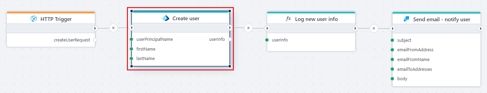

# Create user

Creates a new user in a Microsoft Entra ID tenant.

**Example**   
This flow creates a user in the Microsoft Entra ID. The user information is received through an [HTTP Trigger](../../triggers/http-trigger.md). After the user is created, the user details are logged using a [function](../built-in/function.md), and a confirmation email with the temporary passwordis sent using the [Send email](../sendgrid/send-email.md) action.

 

## Properties

| Name | Type | Description |
|------|------|-------------|
| Title                    | Optional | The title of the action. |
| Connection               | Required | The [Microsoft Entra ID connection](./connecting-to-entra-id.md) to the tenant. The app registration/service principal must have (at minimum) the delegated or application permission **User.ReadWrite.All** (least privilege) to create a user. |
| User Principal Name      | Required | Enter or select a valid [User Principal Name (UPN)](https://learn.microsoft.com/en-us/entra/identity/hybrid/connect/plan-connect-userprincipalname). |
| Password                 | Optional | Either enter or select a valid password, or leave empty to generate a new (returned in result). |
| First name               | Optional | The first name (given name) of the user. |
| Last name                | Optional | The last name (surname) of the user. |
| Display name             | Optional | If not specified, the first/last name or first part of the UPN is used. |
| Mail nickname            | Optional | Specify the part before @ in the mail adress. (often initials or alternative short (nick) names). |
| Enable Account           | Optional | Specifies whether the user account is enabled (default). |
| Wait for user propagation  | Optional | Specifies whether to pause until the user is fully created and synced in the Entra ID tenant (default: true). |
| Result variable name     | Required | The name of the variable that returns information about the created user. |
| Disabled                 | Optional | Boolean value indicating whether the action is disabled (true/false). |
| Description              | Optional | Additional details or notes about the action. |

 

## Returns

Information about the created user:

| Property | Description |
|----------|-------------|
| Id  | The user Id. May be <i>null</i> if not waiting for propagation. |
| Password | The provided or generated temporary password (user must change at first sign‑in). |
| Display name | The resolved display name. | 
| MailNickname | The resolved mail nickname. | 
