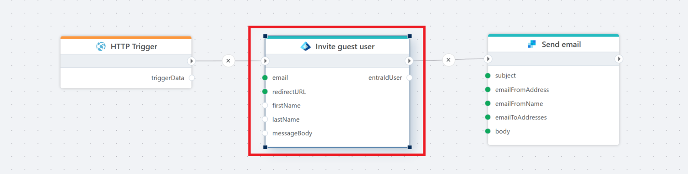

# For each client secret

Lists each client secret for an app registration in a Microsoft Entra ID tenant.

**Example**   
This flow is called from an HTTP trigger and invites a guest user to a Microsoft Entra ID tenant. It also sends a customized email message instead of using the default invitation message. 

## Properties

| Name                     | Type     | Description                                                                 |
|--------------------------|----------|-----------------------------------------------------------------------------|
| Title                    | Optional | The title of the action.                                                    |
| Connection               | Required | The [Microsoft Entra ID connection](./connecting-to-entra-id.md) to the tenant. The app registration/service principal must have (at minimum) **Application.Read.All** to list client secrets for an application (broader permissions like Application.ReadWrite.All also work but are not required). |
| App ID                   | Optional | The ID of the app registration for which to list client secrets.           |
| Client secret variable name     | Required | The name of the variable that stores the response from the Entra ID API (e.g., EndDate). |
| Disabled  | Optional | Boolean value indicating whether the action is disabled (true/false).  |
| Description              | Optional | Additional details or notes about the action.                               |

## Returns (optional)

Returns an `EntraIdClientSecretInfo` object with the following properties set.

| Name        | Description                                                      |
|-------------|------------------------------------------------------------------|
| KeyId       | The key (identifier) of the client secret.                       |
| DisplayName | (If available) The display name assigned to the client secret.   |
| StartDate   | The start (activation) date/time (UTC) of the client secret.     |
| EndDate     | The expiration date/time (UTC) of the client secret.             |