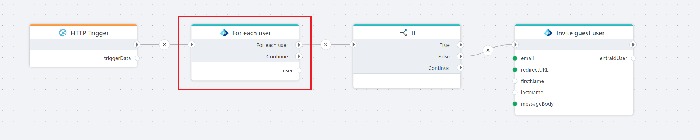

# For each user

Lists all users in a Microsoft Entra ID tenant.

**Example**   
This flow iterates through all existing users in a Microsoft Entra ID tenant. For each user, it checks if their email address exists within a predefined list of emails to be invited. If a match is found, the address is removed from the invitation list. Finally, the flow loops through the remaining email addresses on the list and sends each a guest invitation to join the tenant.

## Properties

| Name                     | Type     | Description                                                                 |
|--------------------------|----------|-----------------------------------------------------------------------------|
| Title                    | Optional | The title of the action.                                                    |
| Connection               | Required | The [Microsoft Entra ID connection](./connecting-to-entra-id.md) to the tenant. The app registration/service principal must have (at minimum) **User.Read.All** to list users (Directory.Read.All or higher privileges also work but are not required). |
| User variable name       | Required | The name of the variable that stores the response from the Entra ID API (e.g., Mail). |
| Include extended profile | Optional  | Defaults to false. If set to true, the response will include extended directory attributes (e.g., companyName, employeeId, department) and the user's manager reference. **Benefit**: Provides a richer user profile in a single query. **Cost**: Results in a larger payload and a slower response time. |
| Disabled  | Optional | Boolean value indicating whether the action is disabled (true/false).  |
| Description              | Optional | Additional details or notes about the action.                               |

## Returns

Returns an EntraIdUser object with the following properties. The column "Extended profile only" indicates fields that are only populated when the action property "Include extended profile" is set to true.

| Name                 | Extended profile only | Description |
|----------------------|-----------------------|-------------|
| ObjectId             | No                    | The Object (user) ID. |
| UserPrincipalName    | No                    | The UPN (e.g., alice@contoso.com). |
| DisplayName          | No                    | Full display name. |
| Email                | No                    | Preferred email. |
| UserType             | Yes                   | User classification (Member or Guest). |
| FirstName            | Yes                   | Given name. |
| LastName             | Yes                   | Surname. |
| MobilePhone          | Yes                   | Mobile phone number. |
| CompanyName          | Yes                   | Company / organization name (if set). |
| Department           | Yes                   | Department name (if set). |
| EmployeeId           | Yes                   | Internal employee identifier (if present). |
| EmployeeType         | Yes                   | Employee type classification (e.g., Contractor, Employee). |
| EmployeeHireDate     | Yes                   | Hire date (if exposed/licensed). |
| EmployeeLeaveDateTime| Yes                   | Planned or actual leave/end date (if set). Requires User-LifeCycleInfo.Read.All permission. |
| ManagerId            | Yes                   | ObjectId of the user's manager. |
| Country              | Yes                   | Country/region value (ISO or free-form). |
| AccountEnabled       | Yes                   | Indicates whether the account is enabled. |
| CreatedDateTime      | Yes                   | When the user object was created in Entra ID. |