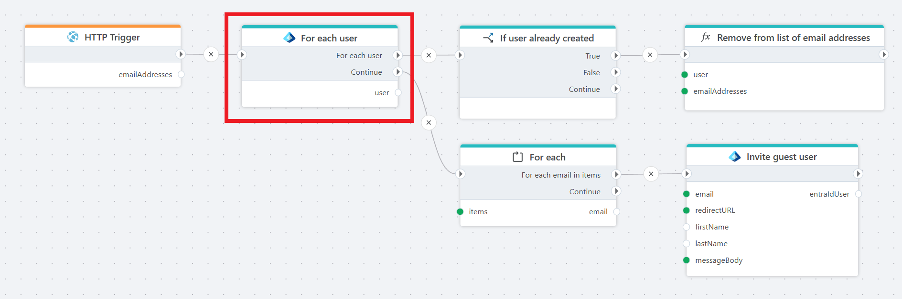

# For each user

Lists each user in a Microsoft Entra ID tenant.

**Example**   
This flow is called from an HTTP trigger and loops through the existing users in a Microsoft Entra ID tenant. If a user is not already a guest, the flow sends an invitation to join the tenant as a guest.

## Properties

| Name                     | Type     | Description                                                                 |
|--------------------------|----------|-----------------------------------------------------------------------------|
| Title                    | Optional | The title of the action.                                                    |
| Connection               | Required | The [Microsoft Entra ID connection](./connecting-to-entra-id.md) to the tenant. The app registration/service principal must have (at minimum) **User.Read.All** to list users (Directory.Read.All or higher privileges also work but are not required). |
| User variable name       | Required | The name of the variable that stores the response from the Entra ID API (e.g., Mail). |
| Include extended profile | Optional  | When true, expands the Graph query to return additional directory/profile attributes and the manager reference. Adds: accountEnabled, companyName, country, createdDateTime, department, employeeHireDate, employeeId, employeeLeaveDateTime, employeeType, mobilePhone, userType, plus manager (exposed as ManagerId). When false these fields (except basic identity fields) are omitted/null to minimize payload. Slightly higher latency and permission surface (still satisfied by User.Read.All). |
| Disabled  | Optional | Boolean value indicating whether the action is disabled (true/false).  |
| Description              | Optional | Additional details or notes about the action.                               |

## Returns

Returns an EntraIdUser object with the following properties.

| Name            | Description |
|---------------------|-------------|
| ObjectId            | The Object (user) ID. |
| UserPrincipalName   | The UPN (e.g., alice@contoso.com). |
| UserType            | User classification (Member or Guest). |
| FirstName           | Given name. |
| LastName            | Surname. |
| DisplayName         | Full display name. |
| Email               | Preferred email. |
| MobilePhone         | Mobile phone number. |
| CompanyName         | Company / organization name (if set). |
| Department          | Department name (if set). |
| EmployeeId          | Internal employee identifier (if present). |
| EmployeeType        | Employee type classification (e.g., Contractor, Employee). |
| EmployeeHireDate    | Hire date (if exposed/licensed). |
| EmployeeLeaveDateTime | Planned or actual leave/end date (if set). To read this property the User-LifeCycleInfo.Read.All permission is required. |
| ManagerId | ObjectId of the user's manager (the directory object representing their manager). Will be null unless the Microsoft Graph request expands the manager relationship (e.g. add `$expand=manager($select=id)` in the user query). |
| Country             | Country/region value (ISO or free-form). |
| AccountEnabled      | Indicates whether the account is enabled. |
| CreatedDateTime     | When the user object was created in Entra ID. |