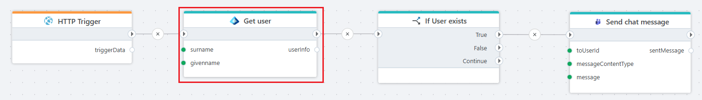

# Get user

Gets information about a user from a Microsoft Entra ID tenant by one or more query parameters.

Use this if You want to get more information (like OID or UPN) about a user from e.g. mail or name. 

**Example**   

This flow receives an payload from an [HTTP Trigger](../../triggers/http-trigger.md). The payload contains a users given name and surname. The Entra ID `Get User` action described here tries to query the user. [If](../built-in/if.md) the user exists (OID or UPN set), a message from the payload is sendt to a [chat in Teams](../microsoft-teams/send-chat-message.md).

 

## Properties

| Name           | Type           | Description                        |
|----------------|----------------|------------------------------------|
| Title                    | Optional | The title of the action. |
| Connection               | Required | The [Microsoft Entra ID connection](./connecting-to-entra-id.md) to the tenant. The app registration/service principal must have (at minimum) **User.Read.All** to locate the user (Directory.Read.All or higher privileges also work but are not required). |
| Query Parameter(s)       | Required | One or more parameters to locate the user. See below for more information. |
| Include extended profile | Optional  | Defaults to false. If set to true, the response will include extended directory attributes (e.g., companyName, employeeId, department) and the user's manager reference. **Benefit**: Provides a richer user profile in a single query. **Cost**: Results in a larger payload and a slower response time. |
| Result variable name     | Required | The name of the variable that returns information about the user. |
| Disabled                 | Optional | Boolean value indicating whether the action is disabled (true/false). |
| Description              | Optional | Additional details or notes about the action. |

 

## Query Parameters

Following options can be selected or entered for query parameters (one o more can be addd) :

| Option         | Description    |
|----------------|----------------|
| OID | Object ID / ID / User ID of the user. Unique parameter that can be used to e.g. get UPN, Display Name or Mail. | 
| UPN | User Principal Name of the user. Unique parameter that can be used to e.g. get OID, Display Name or Mail. |
| Mail | The e-mail of an user. Usualy a unique parameter that can be used to get e.g. OID, UPN or Display Name. | 
| Display Name | The full name of the user. |
| Given/First Name | The first name of a user. This may not be enough to get the correct user by itself. | 
| Surname/Last Name | The last name of an user.  This may not be enough to get the correct user by itself. | 

 

## Returns

Returns an EntraIdUser object with the following properties. The column "Extended profile only" indicates fields that are only populated when the action property "Include extended profile" is checked (set to true).

| Name                 | Extended profile only | Description |
|----------------------|-----------------------|-------------|
| ObjectId             | No                    | The Object (user) ID or OID. |
| UserPrincipalName    | No                    | The UPN (e.g., alice@contoso.com). |
| DisplayName          | No                    | Full display name. |
| Email                | No                    | Preferred email. |
| UserType             | Yes                   | User classification (Member or Guest). |
| FirstName            | Yes                   | Given name. |
| LastName             | Yes                   | Surname. |
| MobilePhone          | Yes                   | Mobile phone number. |
| CompanyName          | Yes                   | Company / organization name (if set). |
| Department           | Yes                   | Department name (if set). |
| EmployeeId           | Yes                   | Internal employee identifier (if present). |
| EmployeeType         | Yes                   | Employee type classification (e.g., Contractor, Employee). |
| EmployeeHireDate     | Yes                   | Hire date (if exposed/licensed). |
| EmployeeLeaveDateTime| Yes                   | Planned or actual leave/end date (if set). Requires User-LifeCycleInfo.Read.All permission. |
| ManagerId            | Yes                   | ObjectId of the user's manager. |
| Country              | Yes                   | Country/region value (ISO or free-form). |
| AccountEnabled       | Yes                   | Indicates whether the account is enabled. |
| CreatedDateTime      | Yes                   | When the user object was created in Entra ID. |

