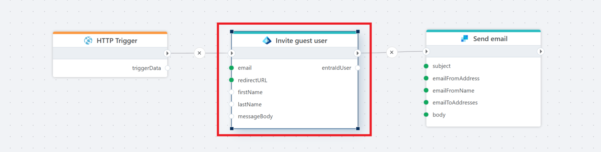

# Invite guest user

Invites a guest user to a Microsoft Entra ID tenant.

**Example**   
This flow is called from an HTTP trigger and invites a guest user to a Microsoft Entra ID tenant. It also sends a customized email message instead of using the default invitation message. 

## Properties

| Name                     | Type     | Description                                                                 |
|--------------------------|----------|-----------------------------------------------------------------------------|
| Title                    | Optional | The title of the action.                                                    |
| Connection               | Required | The [Microsoft Entra ID connection](./connecting-to-entra-id.md) to the tenant. The app registration/service principal must have (at minimum) the delegated or application permission **User.Invite.All** (least privilege) to create invitations. |
| Email account            | Required | The email address of the user to be invited as a guest.                     |
| Redirect URL             | Required | The URL to which the guest user is redirected after accepting the invitation. |
| First name               | Optional | The first name of the guest user (optional).                                |
| Last name                | Optional | The last name of the guest user (optional).                                 |
| Send invitation message  | Optional | Specifies whether to send an invitation email to the guest user (default: true). If false, Message body is disabled. |
| Message body             | Optional | Custom message to include in the invitation email (only applicable if Send invitation message is true).              |
| Wait for user propagation  | Optional | Specifies whether to pause until the guest user is fully created and synced in the Entra ID tenant (default: true). |
| Entra ID user variable name     | Required | The name of the variable that stores the response from the Entra ID API (e.g., InviteRedeemUrl). |
| Disabled  | Optional | Boolean value indicating whether the action is disabled (true/false).  |
| Description              | Optional | Additional details or notes about the action.                               |

## Returns

Returns an EntraIdUser object with two properties set.

| Name                     | Description                                                                 |
|--------------------------|-----------------------------------------------------------------------------|
| ObjectId                 | The Object ID of the invited guest user.                                                    |
| InviteRedeemUrl          | The redemption URL for the invitation. This is often used as the link for the 'Accept' button in the invitation email. |