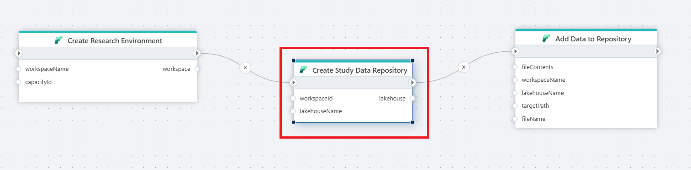

# Create Lakehouse

Creates a Lakehouse in a Microsoft Fabric Workspace.

## Returns
Returns a [LakehouseInfo](#lakehouseinfo) object.

## Properties
| Name          | Type     | Description                             |
|---------------|----------|-----------------------------------------|
| Connection    | Required | The [Microsoft Fabric Connection](./microsoft-fabric-connection.md) used to make an authenticated request to the Microsoft Fabric REST API. To create a Connection, [please follow these steps](./microsoft-fabric-connection.md). Note! Make sure to choose an authentication method and user with the required priviliges.  |
| Workspace Id  | Required | The Workspace that you want to create the Lakehouse in. |
| Lakehouse name | Required | The name of the Lakehouse. Note that the name must be unique within the Workspace.  |
|Enable schemas| Optional | Determines whether schemas are used to organize and structure tables within a lakehouse. Default is false. |
| Wait for provisioning to complete | Optional | Even though a Lakehouse has been created, it may take some time for all Lakehouse features to be ready for use. For example, the SQL Endpoint may not be ready for use immediately after a Lakehouse has been completed. If this property is set to `true`, Flow will wait until the SQL Endpoint has been fully provisioned before continuing execution. |
| Result variable name| Optional | The name of the variable that contains the lakehouse info. |

### LakehouseInfo

| Name               | Type            | Description                |
|--------------------|-----------------|----------------------------|
| Id                 | string          | The id of the Lakehouse    |
| DisplayName        | string          | The name of the Lakehouse  |
| WorkspaceId        | string          | The id of the Workspace    |
| Description        | string          | The description of the Lakehouse   |
| Properties         | [LakehouseProperties](#lakehouseproperties) | Technical information about the Lakehouse.  |

### LakehouseProperties

| Name               | Type            | Description                |
|--------------------|-----------------|----------------------------|
| DefaultSchema      | string          | The default schema of the Lakehouse. |
| OneLakeFilesPath   | string          | OneLake path to the Lakehouse files directory. |
| OneLakeTablesPath  | string          | OneLake path to the Lakehouse tables directory. |
| SqlEndpointProperties | [SqlEndpointProperties](#sqlendpointproperties) | An object containing the properties of the SQL endpoint.|

### SqlEndpointProperties

| Name               | Type            | Description                |
|--------------------|-----------------|----------------------------|
| Id                 | string          | The SQL endpoint ID.       |
| ConnectionString   | string          | SQL endpoint connection string. |
| ProvisioningStatus | string          | The SQL endpoint provisioning status. Values are `InProgress`, `Failed` or `Success` |
