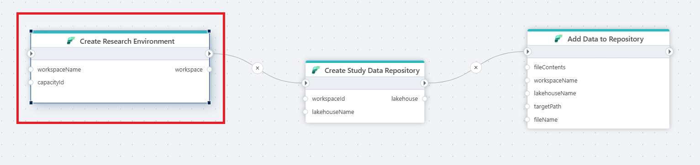

# Create Workspace

Creates a [Workspace](https://learn.microsoft.com/en-us/fabric/get-started/create-workspaces) in Microsoft Fabric. This action enables teams and organizations to automatically provision Workspaces on-demand without having to use the Fabric portal to create them manually.
[Read more](https://learn.microsoft.com/en-us/fabric/get-started/create-workspaces).

## Returns
Returns a [Workspace](https://learn.microsoft.com/en-us/fabric/get-started/workspaces) object.

## Properties

| Name                | Type     | Description    |
|---------------------|----------|------------------------------------|
| Connection          | Required | The [Microsoft Fabric Connection](./microsoft-fabric-connection.md) used to make an authenticated request to the Microsoft Fabric REST API. To create a Connection, [please follow these steps](./microsoft-fabric-connection.md). Make sure to choose an authentication method with required privileges. |
| Workspace Name      | Required | Specifies the name of the workspace to be created or accessed.    |
| Workspace Description | Optional | A brief description of the workspace's purpose or contents.   |
| Capacity Id         | Optional | Specifies the [capacity](https://learn.microsoft.com/en-us/rest/api/fabric/core/capacities/list-capacities?tabs=HTTP) ID for resource allocation, where capacities are dedicated resources in Microsoft Fabric that provide the necessary compute and storage power for efficient data and analytics processing.  |
| Result Variable Name| Optional | The name of the variable in which the workspace result is stored. Default is `workspace`.    |
| Description         | Optional | An additional description of the environment or other relevant information.  |

