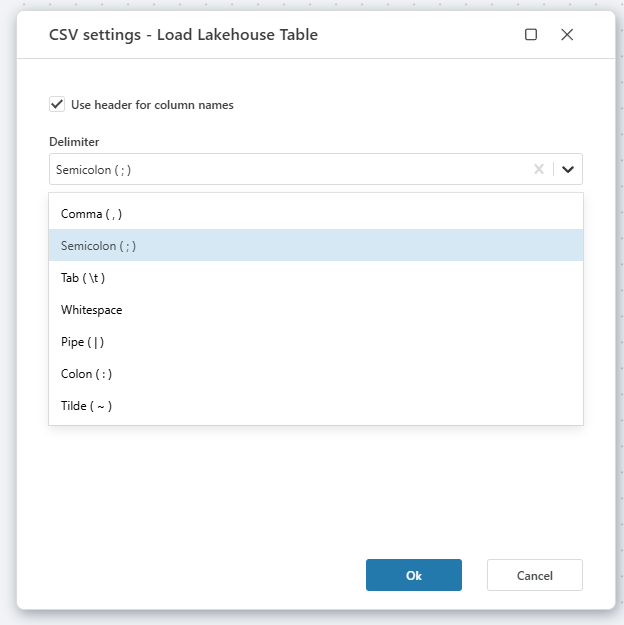
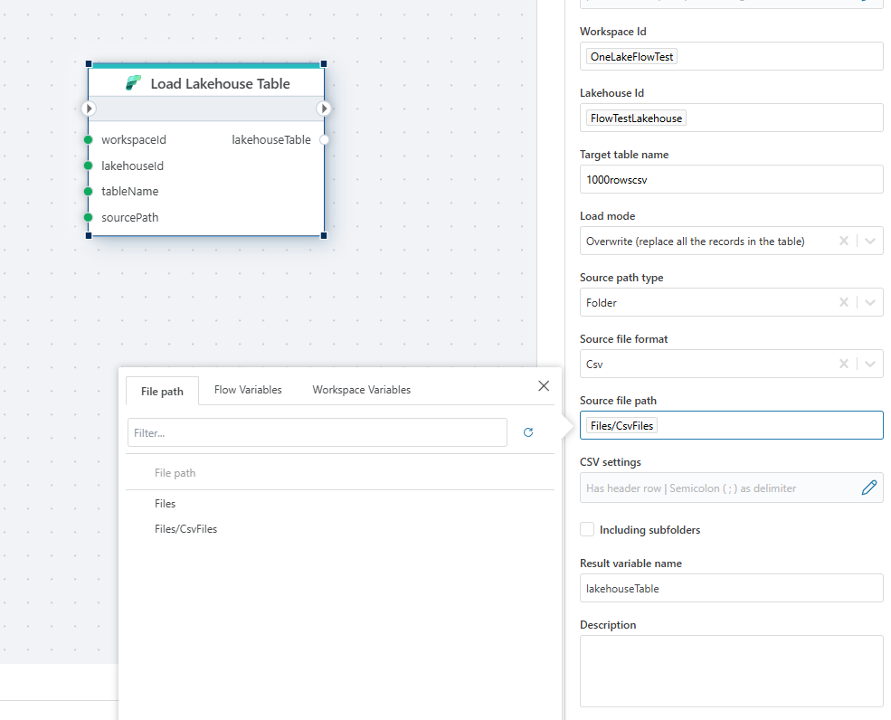
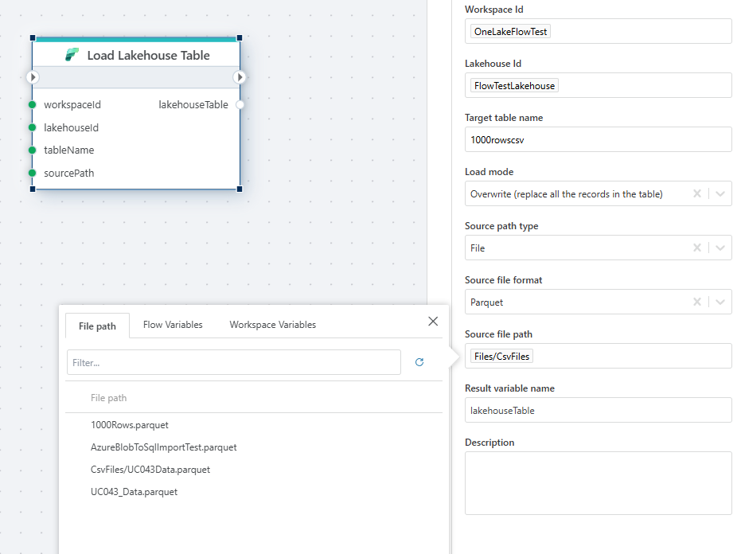

# Load Lakehouse Table

Loads Lakehouse [Table](https://learn.microsoft.com/en-us/fabric/data-engineering/load-to-tables).

 

## Returns

Returns the [LakehouseTableInfo](#lakehousetableinfo).

## Properties

| Name                 | Type       | Description                                                       |
|----------------------|------------|-------------------------------------------------------------------|
| Title                | Optional   | The title for the upload action to the Lakehouse.                 |
| Connection           | Required   | The [Microsoft Fabric Connection](./microsoft-fabric-connection.md) used to make an authenticated request to the Microsoft Fabric REST API. To create a Connection, [please follow these steps](./microsoft-fabric-connection.md). Note! Make sure to choose an authentication method and user with the required priviliges.      |
| Workspace Id         | Required   | Identifies the workspace where the Lakehouse is located.          |
| Lakehouse Id         | Required   | Identifies the specific Lakehouse to load the table into.         |
| Target table name    | Required   | The name of the target table where data will be loaded.           |
| Load mode            | Required   | Defines how data should be loaded (overwrite or append to existing data). 
Source path type: Specifies the source path type. Either "File" or "Folder".|
| Source path type     | Required   | Specifies the source path type, such as "File".                   |
| Source file format   | Required   | The format of the source file, e.g., CSV.                         |
| Source file path     | Required   | Path to the source file, specifying the location of the CSV file. |
| CSV settings         | Optional   | Configuration settings for CSV files, such as delimiters.         |
| Result variable name | Optional   | The variable name to store the result of the load operation.      |
| Description          | Optional   | Additional information about the load operation.                  |

Csv settings dialog:

Folder selector:

File selector:

### LakehouseTableInfo

| Name               | Type            | Description                |
|--------------------|-----------------|----------------------------|
| Id                 | string          | The id of the Lakehouse    |
| DisplayName        | string          | The name of the Lakehouse  |
| WorkspaceId        | string          | The id of the Workspace    |
| Description        | string          | The description of the Lakehouse   |