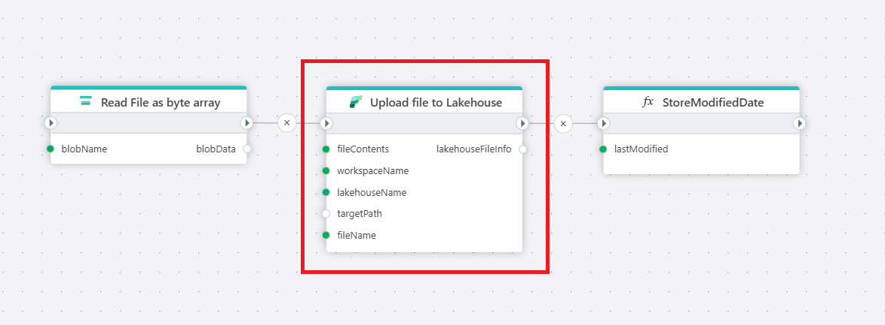

# Upload to Lakehouse

Uploads a file to a Lakehouse in Microsoft Fabric to make it ready for analytics. 

 

## Properties

| Name                             | Type     | Description         |
|----------------------------------|----------|----------------------------------------------------------------------------------|
| Title                            | Optional | The title for the upload action to the Lakehouse.  |
| Connection                       | Required | The [Microsoft Fabric Connection](./microsoft-fabric-connection.md) used to make an authenticated request to the Microsoft Fabric REST API. To create a Connection, [please follow these steps](./microsoft-fabric-connection.md). Note! Make sure to choose an authentication method and user with the required priviliges. |
| File contents                    | Required | Specifies the file content to upload, which can be in the form of a byte array or stream.      |
| Workspace name                   | Required | The name of the Fabric Workspace where the file will be uploaded.         |
| Lakehouse name                   | Required | The name of the Lakehouse in the specified workspace to which the file will be uploaded.    |
| Target folder                    | Optional | The target folder within the Lakehouse where the file should be uploaded.    |
| Target file name                 | Required | The name for the uploaded file in the Lakehouse.                                             |
| Overwrite if file already exists | Optional | Specifies whether to overwrite an existing file with the same name in the target folder.                     |
| Description                      | Optional | A description of the file upload action for easier reference.       |

 

## Returns
This action returns [LakehouseFileInfo](https://learn.microsoft.com/en-us/dotnet/api/azure.storage.files.datalake.models.pathinfo?view=azure-dotnet). 

 

[!INCLUDE ]
