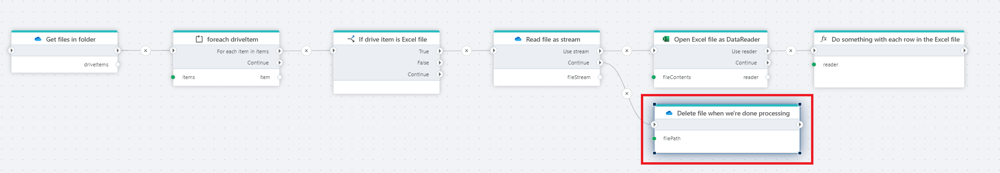

# Delete file from OneDrive

Deletes a file from a OneDrive folder.

**Example**   
This flow retrieves all files from a OneDrive folder, processes only Excel files row by row, and deletes each processed file once its content has been fully handled.

## Properties

<!--prettier-ignore-->
| Name                  | Type      | Description        |
|-----------------------|-----------|--------------------|
| Connection            | Required  | The connection to the OneDrive account. Setting up a connection requires a Microsoft `Work or School account`.|
| File                  | Required  | The path to the file in OneDrive. When using a [OneDriveItem](./api-reference/onedrive-item.md), use the `Path` property like shown in the example image below.  |

> [!NOTE]
> When you want to delete a file in OneDrive, you need to provide the `path` to the file, not the name. When using a [OneDriveItem](./api-reference/onedrive-item.md) as input, select the `Path` property like shown below.  
> [OneDriveItems](./api-reference/onedrive-item.md) are returned from the [For each file in OneDrive](foreach-file-in-onedrive.md) and [Get files in OneDrive](get-files-in-onedrive.md) actions.

