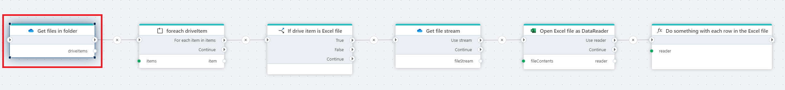

# Get files in folder

Gets a list of files and folders in a OneDrive folder.

## Properties

| Name                 | Type      | Description                                     |
|----------------------|-----------|-------------------------------------------------| 
| Connection           | Required  | The connection to the OneDrive account. Setting up a connection requires a Microsoft `Work or School account`. |
| Folder               | Optional  | The OneDrive folder to read from.               |
| Include folders      | Optional  | True to include folders in the list of [OneDriveItems](./api-reference/onedrive-item.md) to return. |
| Result variable name | Required  | The name of the variable that contains the list of [OneDriveItems](./api-reference/onedrive-item.md) returned. |

## Returns

[List](https://learn.microsoft.com/en-us/dotnet/api/system.collections.generic.list-1) of [OneDriveItems](./api-reference/onedrive-item.md) containing metadata about the files (and optionally folders) in the specified OneDrive folder.  
If no folder is specified, the items in the root folder is returned.
