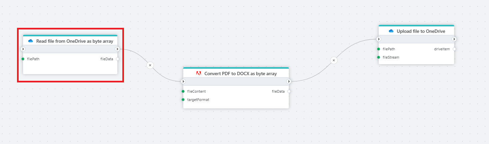

# Read file from OneDrive as byte array

Reads the contents of a file in OneDrive as a byte array.

**Example**   
This flow takes a PDF file from OneDrive, sends it to the [Adobe PDF Services](https://opensource.adobe.com/pdftools-sdk-docs/release/latest/index.html) as a [byte array](../adobe/pdf-to-non-pdf-as-byte-array.md), where it is converted into a DOCX format, and then [uploads](upload-file-to-onedrive.md) it to the selected folder in OneDrive.

## Properties

| Name                 | Type     | Description                                                                                                                                                     |
| -------------------- | -------- | --------------------------------------------------------------------------------------------------------------------------------------------------------------- |
| Connection           | Required | The connection to the OneDrive account. Setting up a connection requires a Microsoft `Work or School account`.                                                  |
| File                 | Required | The path to the file in OneDrive. When using a [OneDriveItem](./api-reference/onedrive-item.md), use the `Path` property like shown in the example image below. |
| Result variable name | Required | The name of the variable containing the file stream.                                                                                                            |

## Returns

Returns the file serialized as a [byte](https://learn.microsoft.com/en-us/dotnet/api/system.byte) [array](https://learn.microsoft.com/en-us/dotnet/csharp/language-reference/builtin-types/arrays).

> [!NOTE]
> When you want to read a file in OneDrive, you need to provide the `path` to the file, not the name. When using a [OneDriveItem](./api-reference/onedrive-item.md) as input, select the `Path` property like shown below.  
> [OneDriveItems](./api-reference/onedrive-item.md) are returned from the [For each file in OneDrive](foreach-file-in-onedrive.md) and [Get files in OneDrive](get-files-in-onedrive.md) actions.

