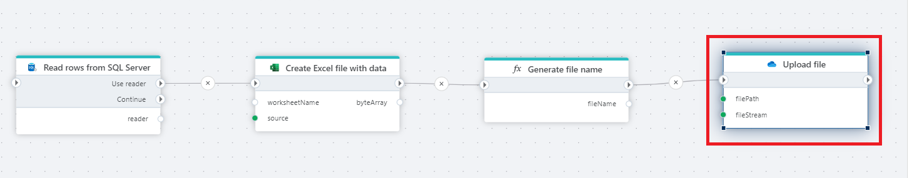

# Upload file to OneDrive

Uploads a file to a OneDrive folder.

**Example**   
This flow reads data from SQL Server, generates an Excel file from the retrieved rows, creates a dynamic file name, and uploads the resulting file to a specified OneDrive folder.

> [!NOTE]
> This action only support uploading files up to `4MB` in size. [Read more here](https://learn.microsoft.com/en-us/onedrive/developer/rest-api/api/driveitem_put_content)

 

## Properties

<!--prettier-ignore-->
| Name                  | Type      | Description        |
|-----------------------|-----------|--------------------|
| Connection            | Required  | The connection to the OneDrive account. Setting up a connection requires a Microsoft `Work or School account`.|
| File path             | Required  | The path to where the file should be uploaded, and the name of the file, for example `MyFolder/MyFile.xlsx`. Note that you can combine variables and predefined values to construct this value.  |
| File data             | Required  | The file data to upload. This must be a [Stream](https://learn.microsoft.com/en-us/dotnet/api/system.io.stream) or byte array. Examples of actions that return a Stream or byte array are [Export to Excel as byte array](../excel/create-excel-file-as-byte-array.md) |
| Conflict behavior     | Required  | Defines what should happen if a file with the same name already exists. |

 

## Returns

[OneDriveItem](./api-reference/onedrive-item.md) that represents the uploaded file if the operation succeeds.
