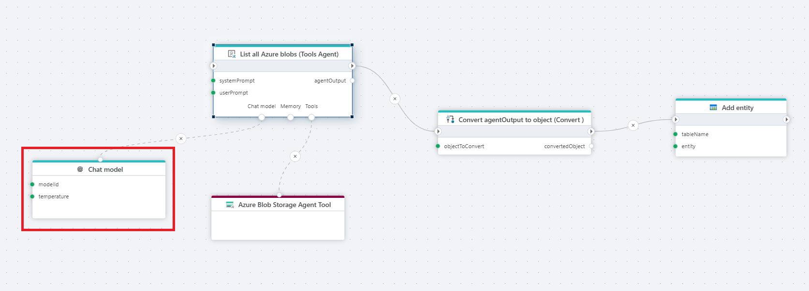

# OpenAI chat model

Defines an [OpenAI](https://platform.openai.com/docs) chat model that an AI Agent, such as the Tools AI Agent, can use to reason about what actions to take.

**Example**   
This flow uses an AI Agent powered by an OpenAi chat model to retrieve a list of blobs from Azure Blob Storage and store the results in a table.

## Properties

| Name                  | Type      | Description |
|-----------------------|-----------|-------------|
| Title                 | Optional  | The title of the model. |
| Connection            | Required  | Defines the [connection](openai-connection.md) to **OpenAI**. |
| Model Id       | Required  |	The identifier of the model to be used, such as gpt-4, gpt-3.5-turbo, etc. This determines the capabilities and cost of the model. |
| Temperature       | Optional  |Temperature in models controls the randomness and creativity of the generated responses. Lower temperatures (e.g., 0.2) produce more focused, predictable text, ideal for tasks that require precision. Higher temperatures (e.g., 1.5) increase creativity and variability, but may risk generating less coherent or relevant content, making it important to adjust based on your desired outcome. |
| Max Tokens | Optional | Sets a limit on the number of tokens (words, characters, or pieces of text) in the model’s response. |
| Result variable name | Optional | The name of the variable in which the result will be stored. |
| Description       | Optional  | Additional details or notes. |

 