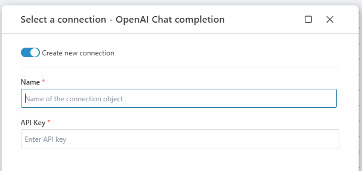

# Connecting to OpenAI

**OpenAI** connection allows users to interact with an [OpenAI](https://platform.openai.com/docs/api-reference/introduction) service by providing an api key.

## Connection Details

An OpenAI connection consists of the following fields:

| Field            | Description                                                  |
|----------------|----------|--------------------------------------------------------------|
| **Name**           | Name of the connection.                                      |
| **API Key**        | The API key used for authentication.                        |

