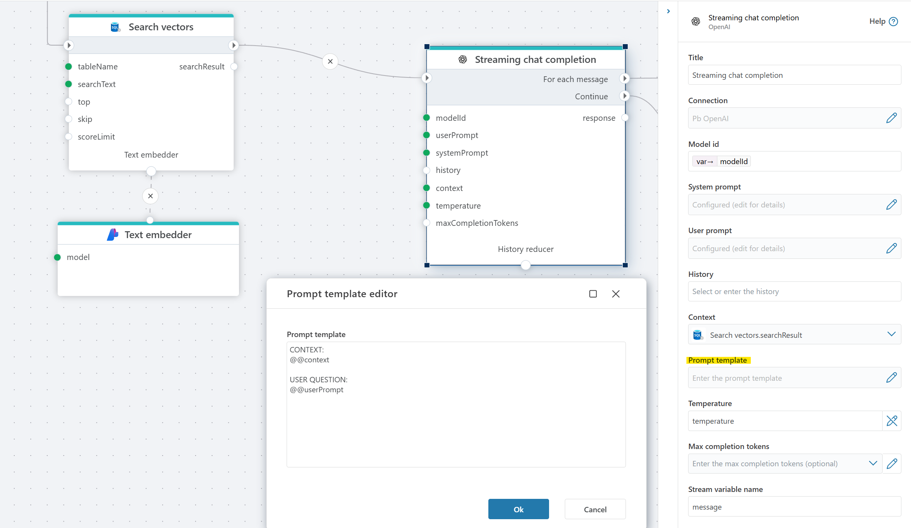

# Streaming chat completion

Streams the response from a chat completion model, one message at a time.

You will typically use this action to build backends for chat clients.

**Example**   
The example above shows a Flow that provides chat completions to a chat client. We're using [PostgreSQL vector search](../postgresql/vector-search.md) to enable RAG, and SQL Server to store and retrieve the chat history so that users can ask follow-up questions.

 

 
## Properties

| Name                  | Type      | Description |
|-----------------------|-----------|-------------|
| Title                 | Optional  | The title of the action. |
| Connection            | Required  | Defines the [connection](openai-connection.md) to **OpenAI**. |
| Model id              | Required  | ID of the chosen [model](https://platform.openai.com/docs/models). |
| System prompt         | Optional  | A system-level instruction that guides the model’s behavior and response style. |
| User prompt           | Required  | The input message from the user, which the model processes to generate a response. |
| History               | Optional  | A record of past interactions that provides context to the conversation, helping the model maintain continuity. |
| Context               | Optional  | Additional context information to influence the response (if supported). |
| Prompt template   | Optional  | Defines the structure of the prompt sent to the model. The system replaces the placeholders @@context and @@userPrompt with the relevant information. See example below. |
| Temperature           | Optional  | Controls randomness/creativity of responses. Lower = more focused; higher = more creative. Default: 0.7. |
| Max completion tokens | Optional  | Sets a limit on the number of tokens in the model’s response. |
| Result variable name  | Optional  | Stores the generated AI response. Default: `response`. |
| Description           | Optional  | Additional details or notes regarding the chat completion setup. |

 

#### Prompt template

The prompt template allows you to specify the format of the prompt that is sent to the language model. This is useful for customizing how context and instructions are provided to the model.
Within the template, you can use the following placeholders:

- @@context: This is replaced by the "Context" property value.
- @@userPrompt: This is replaced by the "User prompt" property value.

The system will substitute these placeholders with the corresponding values before sending the prompt to the model.

**Example**  

  
