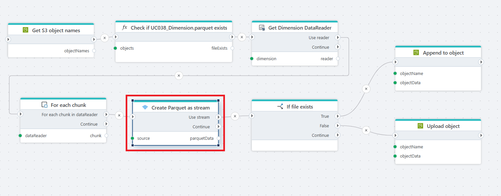

# Create Parquet file as stream

Creates a Parquet file from a [DataReader](https://learn.microsoft.com/en-us/dotnet/api/system.data.idatareader) or [DataTable](https://learn.microsoft.com/en-us/dotnet/api/system.data.datatable) and returns the result as a [Stream](https://learn.microsoft.com/en-us/dotnet/api/system.io.stream).

**Example**

Using data table as Source:

**Example**   
This Flow performs an incremental load of a dimension into a Parquet file stored in S3. It first retrieves the list of S3 objects and uses a custom function to check whether UC038_Dimension.parquet already exists. The dimension data is then read as a DataReader and processed in chunks, with each chunk converted to Parquet format as a stream. For each chunk, the Flow evaluates the file existence flag: if the Parquet file is already present, the stream is appended to the existing object; otherwise, a new Parquet object is created and uploaded. This pattern is useful for implementing incremental data loads without recreating the entire Parquet file.
 

## Properties

| Name                 | Type     | Description                                                                             |
| -------------------- | -------- | ------------------- |
| Title                |   Optional  |   The title for the create action.      |
| Source               | Required | Specifies the source of the data, which can either be a [DataReader](https://learn.microsoft.com/en-us/dotnet/api/system.data.idatareader) or [DataTable](https://learn.microsoft.com/en-us/dotnet/api/system.data.datatable). |
| Result variable name | Required | The name of the variable you can use to reference the Stream in other actions.                                               |
| Description  | Optional |   Additional notes or comments about the action or configuration.  |

 

## Returns

[Stream](https://learn.microsoft.com/en-us/dotnet/api/system.io.stream)

 

