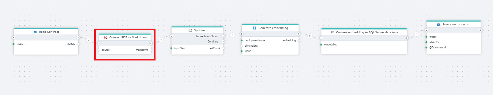

# Convert a PDF file to Markdown

Converts a PDF file to [Markdown](https://en.wikipedia.org/wiki/Markdown).

**Example**   
This Flow reads a contract (PDF file) from [OneDrive](../onedrive/read-file-from-onedrive-as-byte-array.md), converts it to Markdown, [splits the text](../ai/split-text.md) into chunks, [generates embeddings](../azure-ai/generate-embedding.md) for each chunk, converts the generated vector into a SQL Server-compatible format and stores the text, vector, and document reference in a SQL Server table. This table can then be used for [vector search](../postgresql/vector-search.md) or to feed chat models with the extracted information. 

 

## Properties

| Name                 | Type     | Description                                                                                                   |
| -------------------- | -------- | ------------------------------------------------------------------------------------------------------------- |
| Title                | Optional |   The title of the action.                    |
| File Data            | Required | Specifies the source of the PDF file, which can either be a Stream or a Byte Array.                          |
| Result variable name | Required | The name of the variable in which the result will be stored. |
| Description          | Optional | Additional notes or comments about the action or configuration. |

 

## Returns

This action returns a string/text in markdown format.

 

>[!NOTE] 
> For best results when converting PDFs with complex content (e.g., tables, images, or multi-column layouts), it is recommended to use [Adobe "Convert a PDF file to a non-PDF file"](../adobe/pdf-to-non-pdf-as-byte-array.md) instead of the "Convert a PDF file to Markdown" action.

