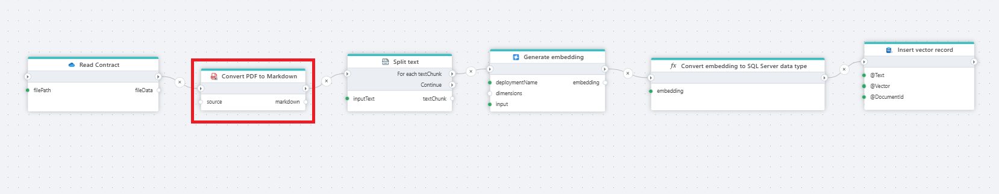

# Split a PDF document 

Splits a PDF document and returns chunks of page(s) as byte array.

<!---

**Example**   
This Flow reads a contract (PDF file) from [OneDrive](../onedrive/read-file-from-onedrive-as-byte-array.md), converts it to Markdown, [splits the text](../ai/split-text.md) into chunks, [generates embeddings](../azure-openai/generate-embedding.md) for each chunk, Converts the generated vector into a SQL Server-compatible format and stores the text, vector, and document reference in a SQL Server table. This table can then be used for vector search or to feed chat models with the extracted information.
--->

 

## Returns

This action returns chunks of page(s) as a [byte](https://learn.microsoft.com/en-us/dotnet/api/system.byte) [array](https://learn.microsoft.com/en-us/dotnet/csharp/language-reference/builtin-types/arrays).

 

## Properties

| Name                 | Type     | Description                                                                                                   |
| -------------------- | -------- | ------------------------------------------------------------------------------------------------------------- |
| Title                | Optional |   The title of the action.                    |
| File Data            | Required | Specifies the source of the PDF file.                         |
| Pages per chunk           | Optional | Defines how many pages should be included in each chunk.                         |
| Chunk variable name | Optional | The name of the variable in which the chunk(s) will be stored. |
| Description          | Optional | Additional notes or comments about the action or configuration. |

 

