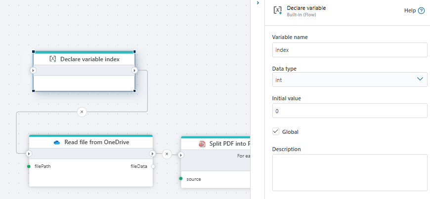
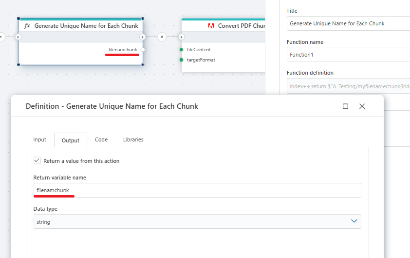

# Split a PDF document 

Splits a PDF document and returns chunks of page(s) as byte array.

**Example**   
This flow reads a PDF file from [OneDrive](../onedrive/read-file-from-onedrive-as-byte-array.md), splits it into smaller chunks, assigns a unique name to each chunk ([function](../built-in/function.md)), converts each chunk to a Word format, and uploads the resulting Word documents back to [OneDrive](../onedrive/upload-file-to-onedrive.md).

The variable initialized at the beginning of the flow (called index) is used to track and generate unique names for each chunk of the PDF after it's split.

When the PDF is split into multiple chunks (pages or groups of pages), each chunk must be saved and uploaded with a unique filename to avoid overwriting previous files and to maintain proper organization.

 We generate the variable first to start a counter (from 0) that we can increment for naming each file chunk.
 

 

 

> [!NOTE]
> Without this step, all chunks would have the same name, and only one file would remain on OneDrive.

 

## Returns

This action returns chunks of page(s) as a [byte](https://learn.microsoft.com/en-us/dotnet/api/system.byte) [array](https://learn.microsoft.com/en-us/dotnet/csharp/language-reference/builtin-types/arrays).

 

## Properties

| Name                 | Type     | Description                                                                                                   |
| -------------------- | -------- | ------------------------------------------------------------------------------------------------------------- |
| Title                | Optional |   The title of the action.                    |
| File Data            | Required | Specifies the source of the PDF file.                         |
| Pages per chunk           | Optional | Defines how many pages should be included in each chunk.                         |
| Chunk variable name | Optional | The name of the variable in which the chunk(s) will be stored. |
| Description          | Optional | Additional notes or comments about the action or configuration. |

 

