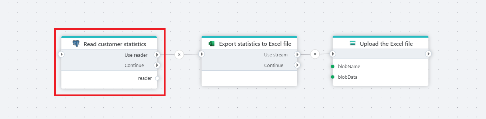

# Get DataReader

Provides a [DataReader](https://learn.microsoft.com/en-us/dotnet/api/system.data.sqlclient.sqldatareader) for reading a forward-only stream of rows from a PostgreSQL database.

 

## Properties

| Name         | Data type       | Description                                       |
|--------------|-----------------|---------------------------------------------------|
| Title           | Optional | The title or name of the command.     |
| Connection         | Required   | The PostgreSQL database [connection](postgresql-connection.md). |
|SQL expression and parameters   | Required      | The command to execute along with any parameters.   |
| Reader variable name | Optional  | Name of the variable.  |
|Command timeout (sec) | Optional | The time limit for command execution before it times out. Default is 120 seconds.|
| Description   | Optional | Additional notes or comments about the action or configuration. |

 

## Returns

[IDataReader](https://learn.microsoft.com/en-us/dotnet/api/system.data.idatareader)

