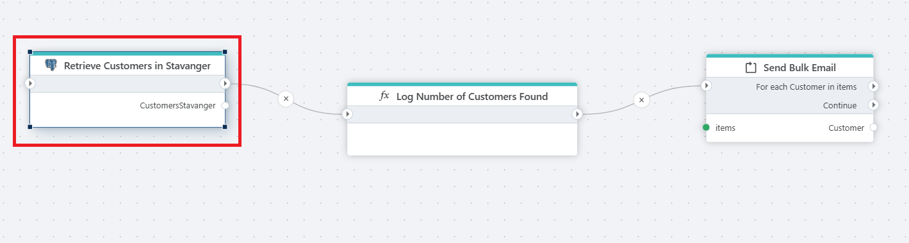

# Get entities

Gets a list of entities based on a query against a PostgreSQL database.

The Get Entities action is ideal for retrieving a list of entities from a PostgreSQL database based on a query. This action is particularly useful when you need to fetch multiple records for tasks like generating reports, creating summaries, or applying bulk operations.

 

 

## Returns

A [List](https://learn.microsoft.com/en-us/dotnet/api/system.collections.generic.list-1) of custom .NET objects with properties specified by the `Entity properties` configuration.

## Properties  

| Name                        | Data Type       | Description                             |
|-----------------------------|-----------------|----------|
| Title                       | Optional        | The title or name of the command.      |
| Connection                  | Required        | The PostgreSQL database [connection](postgresql-connection.md).    |
| SQL expression and parameters | Required      | The SQL command to execute along with any parameters.|
| Entity name                 | Optional        | The name of the entity being retrieved.|
| Entity properties           | Required        | The properties or fields of the entity to configure.    |
| Result variable name        | Optional        | The name of the variable that stores the result of the query.                               |
| Result data type        | Optional        | The type of the stored data.                               |
| Command timeout (seconds)   | Optional        | The time limit for command execution before it times out. Default is 120 seconds.           |
| Description                 | Optional        | Additional notes or comments about the action or configuration.                             |
