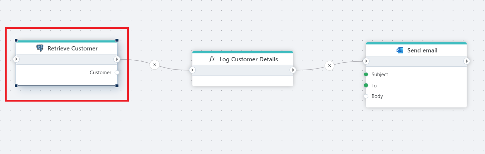

# Get entity

Gets a single entity based on a query against a PostgreSQL database.


<br/>



<br/>

## Returns

Returns an object with the properties specified by the `Entity properties` configuration.

An `entity` is a .NET object with one or more properties, for example

```csharp
public record Customer(string VATNumber, string Name, string Address);
```


## Properties  

| Name                        | Data Type       | Description                         |
|-----------------------------|-----------------|-------------|
| Title                       | Optional        | The title or name of the command. |
| Connection                  | Required        | The PostgreSQL database connection.|
| SQL expression and parameters | Required      | The SQL command to execute along with any parameters.  |
| Entity name                 | Optional        | The name of the entity being retrieved.  |
| Entity properties           | Optional        | The properties or fields of the entity to configure.   |
| Result variable name        | Optional        | The name of the variable that stores the result of the query.    |
| Command timeout (seconds)   | Optional        | The time limit for command execution before it times out. Default is 120 seconds.           |
| Description                 | Optional        | Additional notes or comments about the action or configuration.  |
