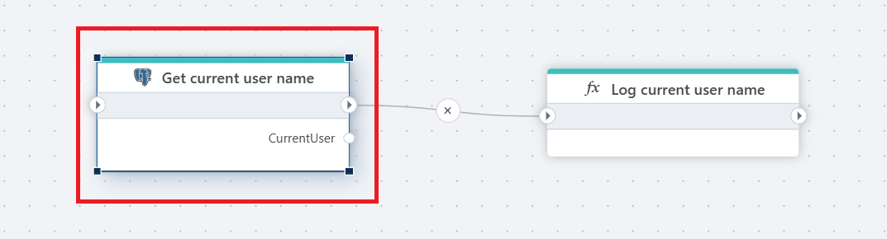

# Get single value

Executes a query command in a PostgreSQL database which returns a single value.

 

 

## Properties  

| Name | Data Type       | Description    |
|-----------------------------|-----------------|----|
| Title       | Optional        | The title or name of the command.        |
| Connection              | Required        | The PostgreSQL database [connection](postgresql-connection.md).      |
| SQL expression and parameters | Required   | The SQL command to execute along with any parameters.    |
| Result variable name    | Optional        | The name of the variable that stores the result of the SQL query.    |
| Result variable type    | Optional        | Specifies the data type of the result variable (e.g., String, Number).          |
| Command timeout (seconds) | Optional       | The time limit for command execution before it times out. Default is 120 seconds.  |
| Description | Optional        | Additional notes or comments about the action or configuration.      |

 

## Returns

Returns a .NET value of the type specified by `Result variable type`.
