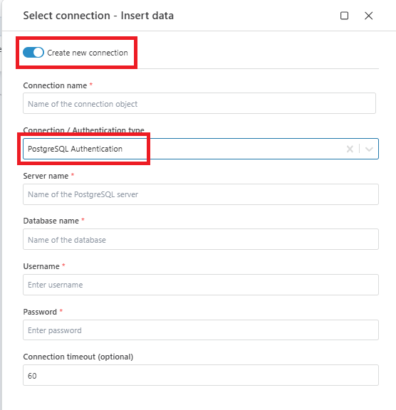
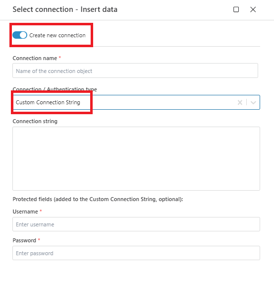

# Connecting to PostgreSQL

When adding a PostgreSQL action, select an **existing connection** or create a new one.

## Connection details
A PostgreSQL connection consists of the following properties:

| Name                          | Data Type   | Description                                           |
|-------------------------------|-------------|-------------------------------------------------------|
| Name                          | Required    | Name of the connection object.                       |
| Connection/Authentication Type| Required    | Type of connection or authentication method used.     |
| Server Name                   | Required    | The name or IP address of the database server.       |
| Database Name                 | Required    | The name of the specific database to connect to.     |
| Username                      | Required    | The username for database authentication.            |
| Password                      | Required    | The password for database authentication.            |
| Connection Timeout            | Optional    | Timeout duration for the connection (in seconds). Default is 60. |

### Steps to Configure
1. Provide a **Name** for the connection.
2. Choose **PostgreSQL Authentication** or a **Custom Connection String** as the connection type.
3. Enter the **Server Name**, **Database Name**, **Username**, and **Password**.
4. (Optional) Set the **Connection Timeout** if required.
5. Click **Test Connection** to verify the details.
6. If successful, click **OK** to save the connection.

### Notes
- Ensure the PostgreSQL server is accessible and credentials are correct.
- For enhanced security, store sensitive credentials securely.
- Use the default timeout unless your environment requires a different configuration.

 

