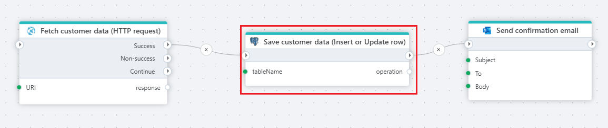

# Insert or update row

Performs an insert or update (upsert) operation on a table row using defined column-value mappings.

**Example** 

The Flow above illustrates how to use the `Insert or Update row` action to save customer information to a PostgreSQL database fetched from a web API. Actions used in this Flow are: [HTTP Request](../http/http-request.md), `Insert or update row`, and [Send email](../microsoft-365-outlook/send-email.md).

## Properties

| Name                  | Type     | Description                                                                       |
| --------------------- | -------- | --------------------------------------------------------------------------------- |
| Title                 | Optional | A descriptive title for the action.                                               |
| Connection            | Required | The PostgreSQL connection.                                                        |
| Table name            | Required | The name of the table to insert or update a row.                                  |
| Column value mapping  | Required | Defines the row to update by specifying the columns and corresponding values.     |
| Result variable name  | Optional | Name of the variable containing the action performed. This always                 |
| Command timeout (sec) | Optional | The time limit for command execution before it times out. Default is 120 seconds. |
| Description           | Optional | Additional notes or comments about the action.                                    |

## Returns (optional)

Returns a string with either `INSERT` or `UPDATE`.
