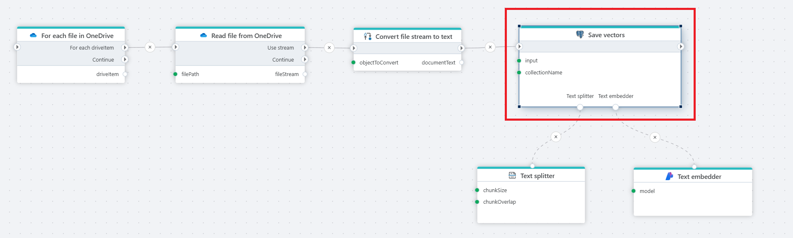

# Save vectors 

Generates and saves vector records to a PostgreSQL database from text input.

**Example**   
This flow [reads](../onedrive/read-file-from-onedrive-as-byte-array.md) files from OneDrive, [converts](../built-in/convert.md) their content to text, [splits](../ai/text-splitter.md) it into chunks, generates [embedding](../azure-ai/text-embedder.md) vectors, and stores them in a PostgreSQL database for semantic search.

 

This action allows saving a text as a list of records in a PostgreSQL vector collection, in a specific format (Profitbase). This is done using the following steps:
1. **Split** - The input text is split into chunks using the Text splitter (link).
2. **Embed** - Each of the chunks resulting from the previous step is embedded using the Text embedder (link)
3. **Build** - A new collection record is built for each of the embedded chunk.
4. **Upsert** - The newly created record is inserted in the database collection.

 

## Properties

| Name               | Type      | Description                                                                 |
|--------------------|-----------|-----------------------------------------------------------------------------|
| Title              | Optional  | The title or name of the action.                                           |
| Connection         | Required  | Select or define your PostgreSQL connection.                               |
| Input text         | Required  | Text to vectorize and save. Can be a variable or static string. |
| Collection name    | Required  | The name of the table or collection in the database where vectors are saved. |
| Record definition   | Optional  | The definition of columns used in the vector search. Note: The vector column is not returned.  |
| Command timeout (seconds) | Optional       | The time limit for command execution before it times out. Default is 120 seconds.  |
| Description | Optional        | Additional notes or comments about the action or configuration.      |

 

## Collection Schema

The collection has the following columns:

- **key** *(String)*:  
  Contains the record's key. This is automatically generated by the node.

- **content** *(String)*:  
  Contains the plain-text of a chunk.

- **vector** *(Vector)*:  
  Contains the vector representation of the `content` column.

- **context** *(String)*:  
  Contains the context of the text inputted in the node. This can be a document name, a URL, or a generic ID representing the resource to which the text pertains.

- **additional columns**:  
  For each custom column defined in the node, a new collection column will be created (including the specified data type).

> [!NOTE]
> In order to use this action, make sure that your Postgres instance has the **pgvector** extension installed.
