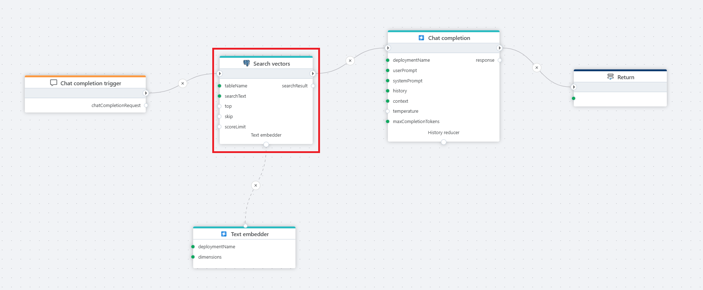
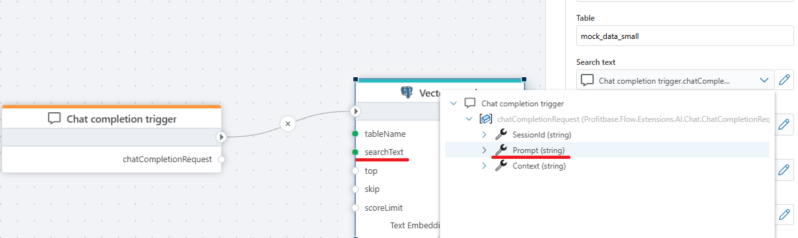
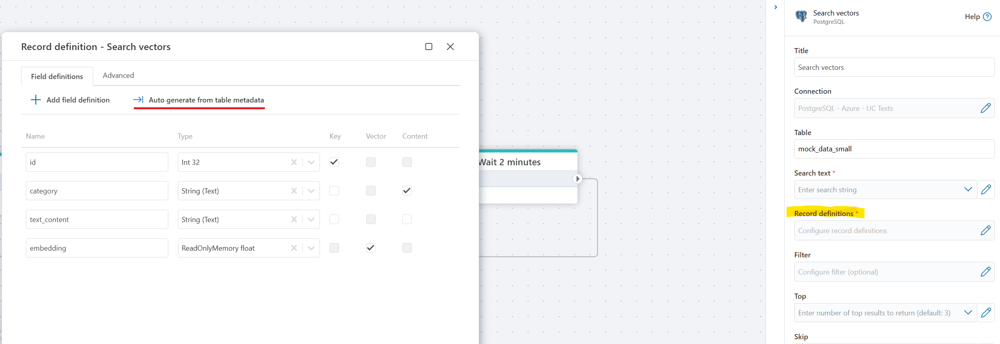

# Vector search

Vector search in a PostgreSQL database.

**Example**   
This flow processes a user's chat question by first receiving it through a [Chat completion](../../triggers/ai/chat-completion-trigger.md) trigger, then converting it into a vector using a [Text embedding generator](../azure-openai/text-embedding-generator.md), performing a **Vector search** in a postgreSQL database for relevant context, and finally passing the user input and retrieved context to Azure OpenAI [Chat completion](../azure-openai/chat-completion.md), which generates a response that is returned to the client via the [Return](../built-in/return.md) node.

 

## Properties

| Name                         | Type      | Description                                                                                      |
|------------------------------|-----------|--------------------------------------------------------------------------------------------------|
| Title                    | Optional  | The title or name of the action. |
| Connection               | Required  | The PostgreSQL database connection that will be used for the search.          |
| Table / view             | Required  | The name of the table or view where the vector search will be performed. |
| Search text              | Required  | The input text string used to perform the vector search, can be provided by a trigger (see below). |
| Record definitions       | Required  | The definition of columns used in vector search. |
| Filter                   | Optional  | A filter expression to narrow down the records (e.g., category == cats ). |
| Top                      | Optional  | The maximum number of top results to return. |
| Skip                     | Optional  | The number of top results to skip (default: *0*). |
| [Distance function](https://learn.microsoft.com/en-us/azure/cosmos-db/gen-ai/distance-functions)  | Optional  | The method for calculating vector similarity, e.g., *Cosine Distance* (default). |
| Score limit (0 to 2)     | Optional  | A threshold value that limits results to those with a similarity score at or above this value. |
| Search result variable name | Optional | The name of the variable to store results. |
| Description              | Optional  | Any additional notes or information relevant to the search configuration. |

 

## Returns 

The Vector Search action returns an object containing a **ToPrompt()** function that is used by the Chat completion Context property (in the example above). The resultObject also contains a set of records containing the *key*, *content* and *vector* columns that the user has specified as **Record Definitions**.  

