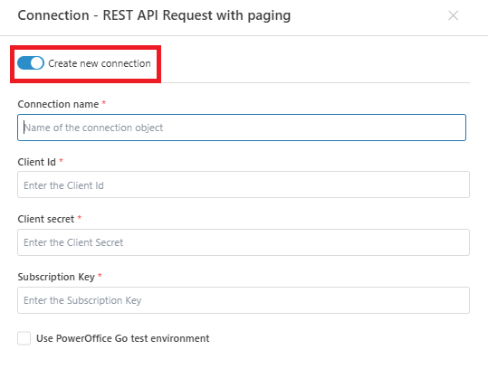

# Connecting to PowerOffice Go

To use PowerOffice Go actions in **Profitbase Flow**, you must either select an **existing connection** or create a new one.

 

The connection authorizes Flow to interact with the PowerOffice Go API on your behalf. It requires authentication credentials issued for your registered client application.

 

## Connection Details

A [PowerOffice Go connection](https://developer.poweroffice.net/documentation/authentication) consists of the following fields:

| Field                                  | Description |
|----------------------------------------|-------------|
| **Connection Name**                    | Required. A user-defined name for this connection. |
| **Client Id**                          | Required. A unique identifier for your application registered with PowerOffice Go. |
| **Client Secret**                      | Required. A confidential string used for authenticating your client app. |
| **Subscription Key**                   | Optional. Required if accessing APIs that need an additional API key. |
| **Use PowerOffice Go test environment** | Optional. If checked, the connection will use demo endpoints for testing. |

 

 

> [!NOTE]
> A [Dynamic Connection](./create-connection.md) can be used to override this default connection during flow execution.  
> This is useful when connecting to different subscriptions programmatically or pulling credentials from external sources at runtime.

 

## Related Documentation

- [PowerOffice Go API authentication](https://developer.poweroffice.net/documentation/authentication)
- [Create dynamic PowerOffice Go connection](./create-connection.md)