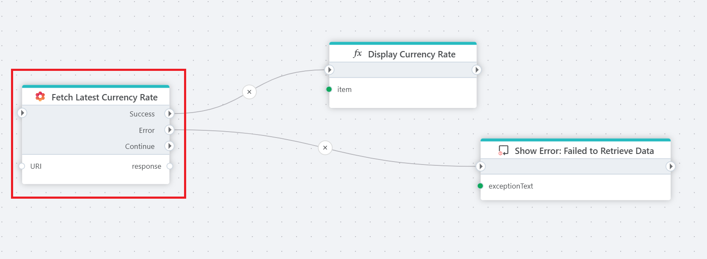

# REST API Request

Use [PowerOffice Go REST APIs (v2)](https://developer.poweroffice.net)  to retrieve or write data.

The **REST API Request** action allows you to interact with [PowerOffice Go REST APIs (v2)](https://prdm0go0stor0apiv20eurw.z6.web.core.windows.net) to read or write data. You can retrieve information such as customers, accounts, or employees, or update records in the PowerOffice Go system using HTTP methods (`GET`, `POST`, `PUT`, `DELETE`, etc.).  

 

  

 

## Properties

| Name             | Type      |Description                                             |
|------------------|-----------|--------------------------------------------------------|
| Title  | Optional | The title or name of the request. |
| Connection | Required  | Select a connection. |
| Configuration | Required | Define configuration. |
| Description | Optional | Additional notes or comments about the action or configuration. |

 

## Returns  

The response from a PowerOffice API request can either be:  
- A **custom data type** defined by the template used, or  
- The raw JSON response from the API.  

To maximize compatibility and performance, we recommend using the [HttpResponse&lt;T&gt;](../../api-reference/built-in-types/http-response.md) type. This provides:  
- The raw response body.  
- Additional details such as the HTTP status code and any errors.  

For further processing, store the raw JSON response in a database or file storage, and use data transformation tools to convert it into the required format.  

 

## Configuration  

### Defining a REST API Request  

To define a request to the PowerOffice Go REST API, you can start from a template, or define it manually:
1. **Method**: Choose the appropriate HTTP method for your request:  
   - `GET`: Retrieve data from PowerOffice (e.g., list customers or invoices).  
   - `POST`: Create new records (e.g., add a new invoice or customer).  
   - `PUT`: Update existing records (e.g., modify accounting settings).  
   - `DELETE`: Remove records (e.g., delete a customer or invoice).  

2. **URI**: Specify the endpoint for your request. For example:  
   - `customer`: To manage customer records.  
   - `invoice`: To work with invoices.  
   - `accountingSettings`: To manage accounting settings.  

3. **Headers**: 
   - Authentication is automatically set up from the connection settings.

4. **Parameters**: Add query or body parameters as required by the endpoint. Use variables or fixed values based on your workflow to customize the request and ensure it retrieves or updates the desired data.  

5. **Response Type**: Use the default `HttpResponse<string>` to work with raw JSON data. For large datasets, this approach is recommended to reduce memory usage and improve performance.

 

## Error handling

If the response from the PowerOffice Go request is of type [HttpResponse&lt;T&gt;](../../api-reference/built-in-types/http-response.md), the response object includes an `IsSuccess` property. If `IsSuccess` is false, the response object will contain an `ErrorContent` property, which relays error messages from the API call or internally thrown exceptions.

For other response types or severe errors, the action will raise an error that could terminate the Flow unless the On Error port is connected or the action is wrapped in a [Try-Catch](../built-in/try-catch.md) block.

The `On Error` handler is triggered for each page error, allowing you to manage errors individually and prevent the Flow from automatically raising an error that might terminate the running process.

 

## API Limits  

PowerOffice enforces rate limits to maintain stable server performance. If you exceed these limits, the API will return a `429 Too Many Requests` error.  
The Action handles this by delaying calls and using retry. If retry limit is reached an error will be returned.

 

By following these guidelines, you can integrate with the PowerOffice API efficiently and avoid common pitfalls.

