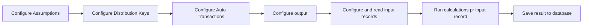

# Calculation Flow

A Calculation Flow is a concept / framework that describes how to create financial calculations for Profitbase InVision.  
The primary steps of a Calculation Flow consists of the steps below.

A Calculation Flow usually has one or more sets of parameters. It also has an input data set, a number of calculations, and an output.  
The most used parameter types are [Assumptions](calculation-flow/assumptions.md), [Distribution Keys](calculation-flow/distribution-keys.md) and [Auto Transactions](calculation-flow/auto-transactions.md).

