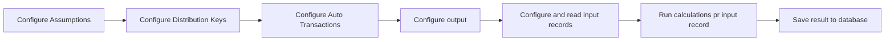

# Calculation Flow

A Calculation Flow consists of a series of actions that define how to create financial calculations for Profitbase InVision.  
The primary steps of a Calculation Flow are outlined below.

A Calculation Flow usually has one or more sets of parameters. It also has an input data set, a number of calculations, and an output.  
The most used parameter types are [Assumptions](assumptions.md), [Distribution Keys](distribution-keys.md) and [Auto Transactions](auto-transactions.md).

It is important that the actions in a Calculation Flow are run in the order outlined above.  
1) You can set up [Assumptions](assumptions.md), [Distribution Keys](distribution-keys.md) and [Auto Transactions](auto-transactions.md) in any order, but the must come **before** the configuration of the [Db Input](read-calculation-flow-db-input.md) and [Db Output](define-calculation-flow-db-output.md) actions.  
2) The [Db Output](define-calculation-flow-db-output.md) action must be defined before the [Db Input](read-calculation-flow-db-input.md) action.  
3) [Saving the result to the database](save-calculation-flow-output.md) must be connected to (after) the `Continue` port of the [Db Input](read-calculation-flow-db-input.md) action, because all rows have been processed when the Db Input completes.  