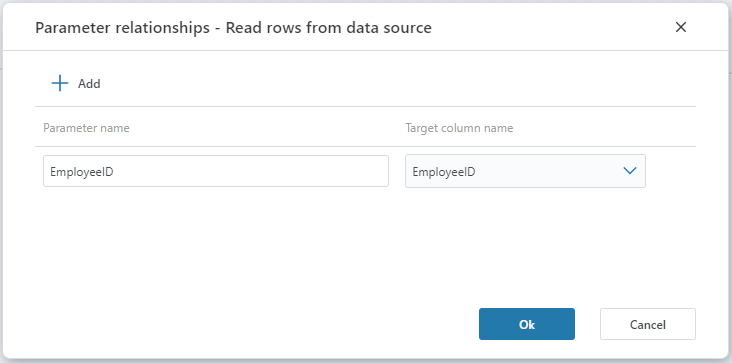

# Parameter relationship

In a [Data Context](data-context.md), the Parameter relationship defines how standalone arguments from the Data Context passed in during execution maps to columns in the Main table.
By defining the Parameter relationship, you essentially define a WHERE clause on the Main table.



## Parameters

| Name                   | Type       | Description                                                                                                                                                     |
|------------------------|------------|-----------------------------------------------------------------------------------------------------------------------------------------------------------------|
| Parameter name         | Required   | The name of the parameter that participates in the the Data Context definition and contains the data that determintes the slice of the main table.              |
| Target column name     | Required   | The name of the column in the main table that we want to filter on.                                                                                             |

##### Example

This example shows the pseudo code for how data from the Main table is sliced when there is a Parameter relationship. The client passes in data context information for a Parameter name.

```sql
SELECT {m.columns} FROM MainTable m
WHERE (m.TargetColumnName = @parameter1Name_arg) OR (r.TargetColumnName = @parameter2Name_arg) ...
```
