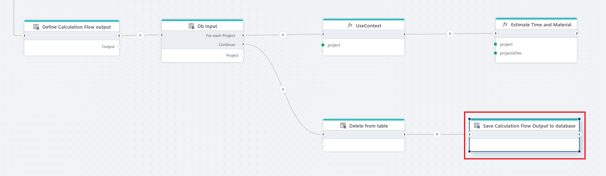
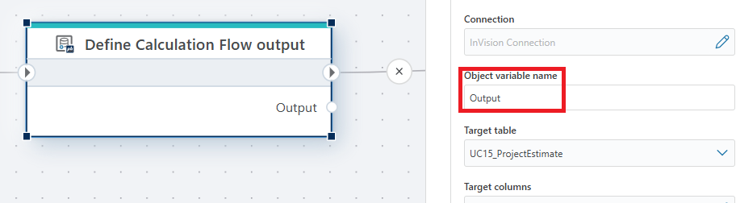
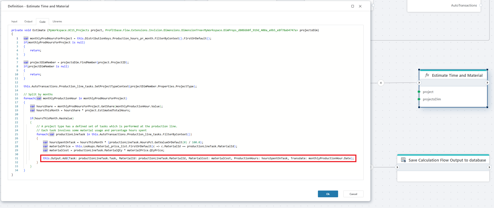

# Save Calculation Flow Output to database

Saves the result of a Calculation Flow to the target table.

**Example**   
This flow is triggered by an HTTP request and performs a complete calculation process for project data. It begins by [loading project dimensions](../load-dimension-tree/dimension-tree.md) and defining [lookup tables](lookup-tables.md), [distribution keys](distribution-keys.md), and [auto transactions](auto-transactions.md) required for the [calculation](../calculation-flow/overview.md). The flow then defines the [output](define-calculation-flow-db-output.md) structure and [iterates](read-calculation-flow-db-input.md) through each project, setting the project context and performing time and material estimations. Before saving the new results, it removes any existing records from the target table. Finally, the calculated output is saved to the database, making the data available for reporting and analysis in InVision or Power BI.

## Properties

| Name              | Type      | Description                                                |
|-------------------|-----------|------------------------------------------------------------|
| Title             | Optional  | Custom title for the action.                               |
| Batch size        | Optional  | Number of rows to write per batch.                         |
| Timeout (seconds) | Optional  | Number of seconds for the operation to complete.           |
| Disabled          | Optional  | Disables the action when checked.                          |
| Description       | Optional  | Additional information or notes about the action.          |

 

### Example

In the example above, the **Estimate Time and Material** [function](../../built-in/function.md) writes calculation results to the output object defined in the **Define Calculation Flow output** step. Each record is added to the Output variable using **this.Output.Add(...)**, ensuring that all computed values are collected and later **saved** to the target database table.

 

 

