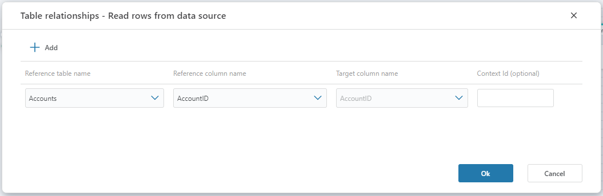

# Table relationship

In a [Data Context](data-context.md), the Table relationship defines the relationship between the main table and one or more reference tables. 
The main table is typically the table that data is read from, written to and/or deleted from, while the reference tables defines which slice of data to read / write / delete from the main table.

> [!NOTE]
> It is not required that there is an actual FK relationship between a Reference table and the Main table in the database.



## Parameters

| Name                   | Type       | Description                                                                                                                                                     |
|------------------------|------------|-----------------------------------------------------------------------------------------------------------------------------------------------------------------|
| Reference table name   | Required   | The name of the reference table that participates in the the Data Context definition and contains the data that determintes the slice of the main table.        |
| Reference column name  | Required   | The name of the column in the reference table that that the main table is joined on.                                                                            |
| Target column name     | Required   | The name of the column in the main table that the reference column is joined on.                                                                                |    
| Context Id             | Optional   | Context Id can be viewed as an alias for "Reference table name". It and can be used by clients that does not have access to the actual reference table, but still needs to pass in a valid Data Context that defines a slice of the main table. A typical use case is when a Calculation Flow is run by a client other than Profitbase InVision.     |

##### Example

This example shows the pseudo code for how data from the Main table is sliced when there is a Table relationship with a single Reference table. The client passes in data context information for the Reference table by providing either the actual table name or the Context Id.

```sql
SELECT {m.columns} FROM MainTable m
INNER JOIN ReferenceTable r ON r.ReferenceColumName = m.TargetColumnName
-- If the calling client provides a Data Context for the reference table, apply a WHERE clause
WHERE (r.DataContextColumn = @dataContext_referenceColumnValue1) OR (r.DataContextColumn = @dataContext_referenceColumnValue2) ...
```