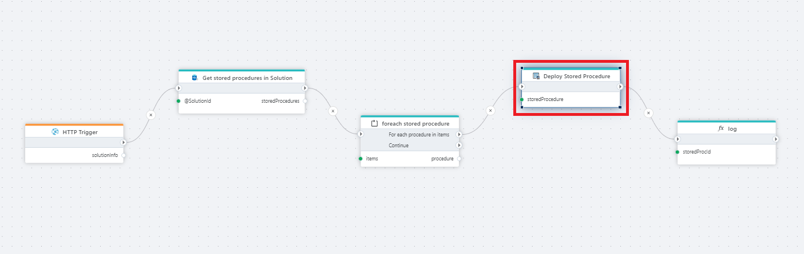

# Deploy Stored Procedure

Recreates a Stored Procedure based on definition from Profitbase InVision.

**Example**   
This flow redeploys stored procedures defined in an InVision solution.  
It is triggered via [HTTP](../../triggers/http-trigger.md), [retrieves](../sql-server/get-datareader.md) all stored procedures for the specified solution, [iterates](../built-in/foreach.md) through them, and recreates each stored procedure in the target environment based on its current InVision definition. The flow [logs](../built-in/log.md) the result of each deployment as it progresses.

## Properties

| Name | Type | Description |
|-----|------|-------------|
| Title | Optional | The name of the action as shown in the flow. |
| Connection | Required | A valid InVision connection used to deploy the stored procedure. |
| Stored Procedure | Required | The ID of the stored procedure definition in InVision to be deployed. |
| Result variable name | Optional | Name of the variable that stores the deployment result, allowing it to be used by subsequent actions. |
| Description | Optional | Additional notes about the action or its configuration. |

## Returns

Returns the result of the stored procedure deployment.
**If Result variable name** is specified, the result is stored in the given variable.