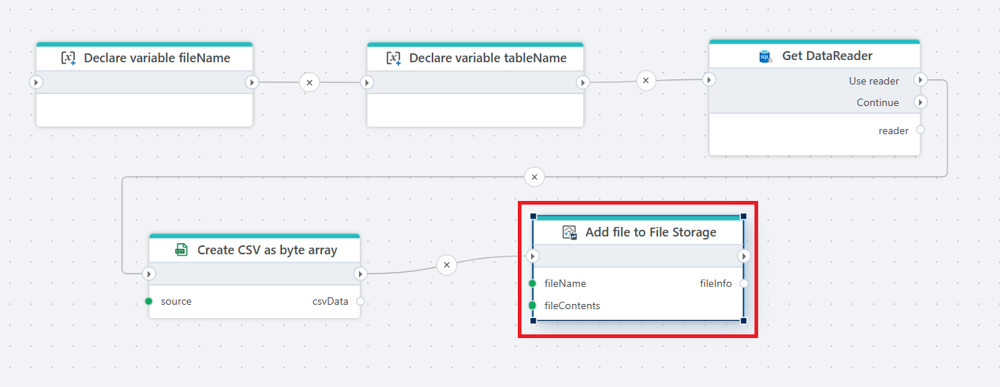

# Add file to File Storage

Adds a file to an InVision [File Storage](/articles/invision/docs/filestorage.md)

This action uploads file content to a selected File Storage and returns information about the created file. It is typically used to export generated content such as CSV, Excel, JSON, or PDF files from a Flow.

**Example**   
This flow exports data from a database table to a CSV file and stores it in File Storage. The flow first [declares variables](../../built-in/declare-variable.md) for the file name and the table name. It then retrieves data from the database using [Get DataReader](../../sql-server/get-datareader.md). The result set is passed to [Create CSV as byte array](../../csv/create-csv-file-as-byte-array.md), which converts the data into CSV format. Finally, the generated file content is uploaded to File Storage using **Add file to File Storage**, using the defined file name.

This allows structured database data to be exported and stored as a downloadable CSV file in File Storage.

## Properties

| Name | Type | Description |
|------|----------|-------------|
| Title | Optional | Descriptive name of the action. |
| Connection | Required | [InVision connection](../invision-connection.md) used to access File Storage. |
| File storage | Required | The target File Storage where the file will be uploaded. |
| File name | Required | Name of the file to create. Can be static or dynamic. |
| File contents | Required | The file content to upload. |
| File context | Optional | Optional metadata object stored together with the file. |
| File MIME type | Optional | MIME type of the file (for example `text/csv`, `application/pdf`). |
| Result variable name | Required | Variable that receives information about the uploaded file. |
| Disabled | Optional | Whether the action is disabled (true/false). |
| Description | Optional | Additional notes about the action. |

## Returns

The action returns file metadata in the specified result variable.