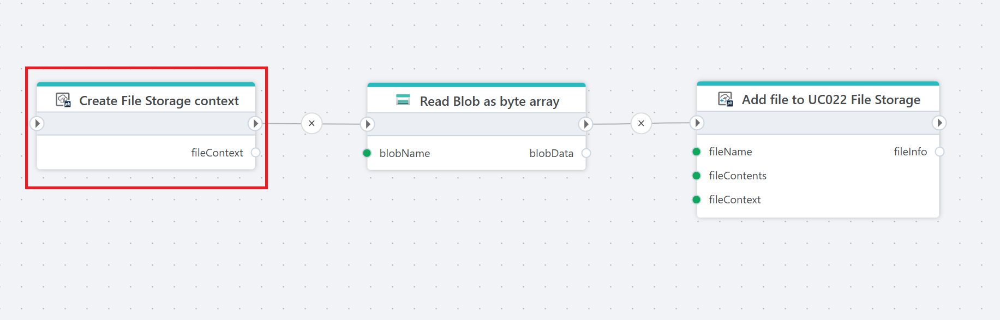

# Create File Storage context

Creates a context for files in an InVision File Storage.

A `context` defines what a file is associated with, for example a project, employee or product. The context can be a composite definition, meaning it can be associated with a combination of multiple entities such as a project, employee AND product.

**Example**   
This flow **creates a File Storage context**, [reads a blob](../../azure-blob-storage/read-blob-as-byte-array.md), and [uploads it as a file to File Storage](add-file-to-file-storage.md) with that context attached.

## Properties

| Name                | Type     | Description                                                                 |
|---------------------|----------|-----------------------------------------------------------------------------|
| Connection          | Required | The [InVision connection](../invision-connection.md) used to access File Storage.    |
| File storage        | Required | The [File Storage](../../../../invision/docs/filestorage.md) where the context should be created.                      |
| File context        | Required | The context definition to create.                                           |
| Result variable name| Required | The name of the variable that will store the created context reference.    |
| Disabled            | Optional | If selected, the action will not execute.                                   |
| Description         | Optional | A custom description of the action configuration.                           |

## Returns

This action returns a context reference. The returned value is stored in the variable defined in Result variable name for example fileContext