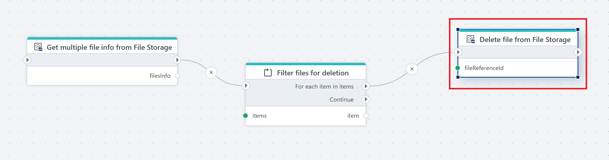

# Delete file from File Storage

Deletes a file from an InVision [File Storage](/articles/invision/docs/filestorage.md).

**Example**   
This flow [loads all files from File Storage](get-files-info-from-file-storage.md), [filters](../../built-in/foreach.md) them based on defined criteria, and deletes the matching files one by one.

## Properties

| Name          | Type     | Description                                      |
|---------------|----------|--------------------------------------------------|
| Connection    | Required | The [InVision connection](../invision-connection.md) used to access File Storage. |
| File storage  | Required | The File Storage from which the file will be deleted. |
| File reference| Required | The reference ID of the file to delete.         |
| Disabled      | Optional | If enabled, the action will not execute.        |
| Description   | Optional | Additional information about the action.        |