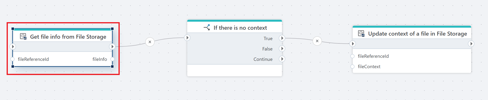

# Get file info from File Storage

Gets metadata information about a (single) file from an InVision [File Storage](/articles/invision/docs/filestorage.md).

**Example**   
This flow updates the context of a file only if it currently has no context. It starts with **Get file info from File Storage**, which retrieves metadata for the specified file and stores it in fileInfo. Next, [If action](../../built-in/if.md) checks whether the file’s context is empty or not defined. If the condition is True meaning no context exists the flow calls [Update context of a file in File Storage](update-file-context-in-file-storage.md), passing the fileReferenceId and the provided fileContext. This assigns a context to the file. If the condition is False, nothing happens and the flow continues without changes.

## Properties

| Name                | Type     | Description                                                                 |
|---------------------|----------|-----------------------------------------------------------------------------|
| Connection          | Required | The [InVision connection](../invision-connection.md) used to access File Storage.    |
| File storage        | Required | The [File Storage](../../../../invision/docs/filestorage.md) where the file is located.                                 |
| File reference      | Required | The reference ID of the file to retrieve information for.                  |
| Result variable name| Required | The name of the variable that will store the returned file information.    |
| Disabled            | Optional | If selected, the action will not execute.                                   |
| Description         | Optional | A custom description of the action configuration.                           |

## Returns

Metadata for a single file in the selected File Storage. The output is stored in the variable defined in Result variable name for example fileInfo.