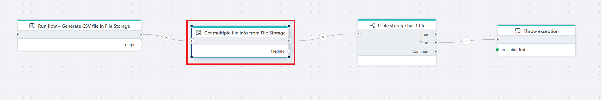

# Get multiple file info from File Storage

Gets a list of metadata information about files in an InVision [File Storage](/articles/invision/docs/filestorage.md).

**Example**   
This flow demonstrates how to use **Get multiple file info from File Storage** to verify that a file has been created successfully. The flow starts by running [Run flow](../../built-in/run-flow.md) action, which creates and stores a CSV file in File Storage. **Get multiple file info from File Storage** retrieves metadata for the files available in the configured storage location. The result is returned as a collection (`filesInfo`). The flow then evaluates the result using [If](../../built-in/if.md) action. If exactly one file is found, the flow continues. If no file or more than one file is found, [Throw exception](../../built-in/throw-exception.md) is executed to explicitly fail the flow.

In short, the flow creates a file, retrieves file metadata from File Storage, and validates that the expected number of files exists before continuing.

 

## Properties

| Name | Type | Description |
|------|------|-------------|
| Title | Optional | A descriptive title for the action. |
| Connection | Required | [The InVision connection](../invision-connection.md) used to access File Storage. |
| File storage | Required | The File Storage instance to retrieve file metadata from. |
| File context | Optional | The source of the file context used to filter or scope the files. |
| Result variable name | Required | The variable that receives the list of file metadata. |
| Disabled | Optional | Specifies whether the action is disabled (true/false). |
| Description | Optional | Additional notes or details about the action. |

 

## Returns

Returns a collection containing metadata for each file found in the specified File Storage location.

The result is assigned to a variable (for example, `filesInfo`) and contains one item per file.

Each item in the collection includes file-level information such as:

| Property          | Description |
|------------------|-------------|
| FileReferenceId | Unique identifier of the file in File Storage. |
| FileName        | The name of the file. |
| FileSize        | The size of the file in bytes. |
| Created         | Date and time when the file was created. |
| Modified        | Date and time when the file was last modified. |

If no files match the specified criteria, the action returns an empty collection.
