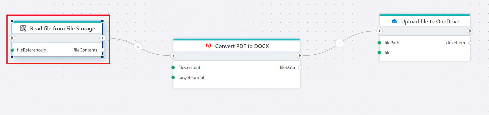

# Read file from File Storage

Reads the contents of a file in an InVision [File Storage](/articles/invision/docs/filestorage.md) into memory as a byte array.

**Example**   
This flow takes a PDF file from File Storage, sends it to the [Adobe PDF Services](https://opensource.adobe.com/pdftools-sdk-docs/release/latest/index.html) as a [byte array](../../adobe/pdf-to-non-pdf-as-byte-array.md), where it is converted into a DOCX format, and then [uploads](../../onedrive/upload-file-to-onedrive.md) it to the selected folder in OneDrive.

 

## Properties

| Name                 | Type       | Description                                                                 |
|----------------------|------------|-----------------------------------------------------------------------------|
| Title                | Optional   | A descriptive title for the action.                                       |
| Connection           | Required   | The [InVision connection](../invision-connection.md) used to access File Storage.   |
| File storage         | Required   | The File Storage location from which the file will be read.               |
| File reference       | Required   | The reference (path or identifier) of the file to read.                   |
| Result variable name | Required   | The name of the variable that will store the file contents.               |
| Disabled             | Optional   | If enabled, the action will not be executed during flow runtime.          |
| Description          | Optional   | Additional information describing the purpose of the action in the flow.  |

 

## Returns

Returns the file serialized as a [byte](https://learn.microsoft.com/en-us/dotnet/api/system.byte) [array](https://learn.microsoft.com/en-us/dotnet/csharp/language-reference/builtin-types/arrays).

 

