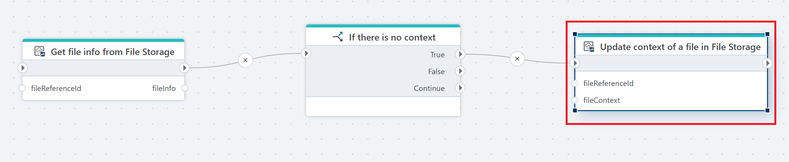

# Update file context in File Storage

Updates the context of a single file in an InVision File Storage.

A `context` defines what a file is associated with, for example a project, employee or product. The context can be a composite definition, meaning it can be associated with a combination of multiple entities such as a project, employee AND product.

**Example**   
This flow updates the context of a file only if it currently has no context. It starts with [Get file info from File Storage](get-file-info-from-file-storage.md), which retrieves metadata for the specified file and stores it in fileInfo. Next, [If action](../../built-in/if.md) checks whether the file’s context is empty or not defined. If the condition is True meaning no context exists the flow calls **Update context of a file in File Storage**, passing the fileReferenceId and the provided fileContext. This assigns a context to the file. If the condition is False, nothing happens and the flow continues without changes.

## Properties

| Name                | Type     | Description                                                                 |
|---------------------|----------|-----------------------------------------------------------------------------|
| Connection          | Required | The [InVision connection](../invision-connection.md) used to access File Storage.    |
| File storage | Required | The [File Storage](../../../../invision/docs/filestorage.md) where the file is located.                                 |
| File reference | Required | The reference ID of the file whose context should be updated.              |
| File context | Required | The new context value to assign to the file.                                |
| Disabled     | Optional | If selected, the action will not execute.                                   |
| Description  | Optional | A custom description of the action configuration.                           |