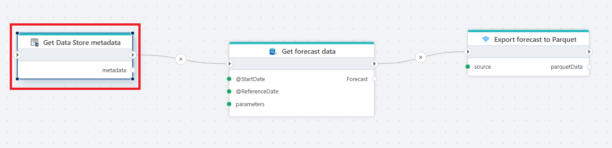

# Get Data Store metadata

Gets metadata information about an InVision Data Store.




**Example**   
This flow reads forecast data from a Data Store for a defined period and converts it into a Parquet payload. It begins with **Get Data Store metadata** to retrieve execution context information. Next, [loads](../sql-server/load-to-datatable.md) the relevant forecast data into a `DataTable` using the provided date parameters. The result is then passed to **Create forecast**, which [generates the Parquet](../parquet/create-parquet-file-as-byte-array.md) file.

<br/>

## Properties

| Property             | Data type                                  | Description                                              |
|----------------------|--------------------------------------------|----------------------------------------------------------|
|TimeFrame.ReferenceDate | [System.DateTimeOffset](https://learn.microsoft.com/en-us/dotnet/api/system.datetimeoffset?view=net-8.0) | The reference / base date of the Data Store. |
| ObjectId             | [System.String](https://learn.microsoft.com/en-us/dotnet/api/system.string)                          | The id of the Data Store Solution object in InVision.    |
| SolutionId           | [System.String](https://learn.microsoft.com/en-us/dotnet/api/system.string)                          | The id of the Solution that the Data Store belongs to.   |
  
## Returns

The action returns a .NET object with the following properties:  

```json
{
    "TimeFrame": {
        "ReferenceDate": System.DateTimeOffset
    },
    "ObjectId": System.String,
    "SolutionId": System.String
}
```