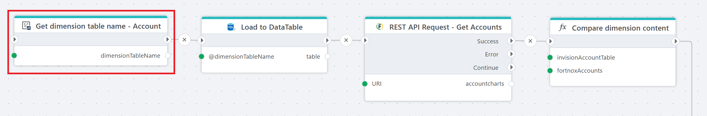

# Get database table name for Dimension

Gets the database table name for a Dimension.

This action retrieves the physical database table name associated with a selected Dimension in InVision. It allows flows to dynamically resolve the correct table name at runtime instead of relying on hardcoded values.

The returned table name can be used in subsequent database actions, such as loading data into a DataTable or executing custom queries.

 

**Example**   
This flow loads account data from InVision, fetches account data from Fortnox, and compares them to identify discrepancies.  

It first uses **Get dimension table name** to resolve the physical table name for the Account dimension. This ensures the flow does not rely on a hardcoded table name. Next, [Load to DataTable](../sql-server/load-to-datatable.md) reads the current Account dimension data from the InVision database using the resolved table name. After that, [REST API Request](../fortnox/rest-api-request.md) – **Get Accounts** calls the Fortnox API to retrieve the list of account charts. Finally, [Compare dimension](../built-in/function.md) content compares the data from the InVision Account table with the accounts returned from Fortnox. The comparison evaluates differences between the two datasets, typically to detect missing, new, or changed accounts.  

## Properties

| Name | Type | Description |
|------|------|-------------|
| Title | Optional | A descriptive title for the action. |
| Connection | Required | InVision connection used to access the solution metadata. |
| Dimension | Required | The Dimension for which the database table name should be retrieved. |
| Table type | Required | Specifies which physical table type to return. Typically `Wide` or `Parent/Child`, depending on the Dimension structure. |
| Result variable name | Required | The name of the variable that will store the resolved table name. |
| Disabled | Optional | When enabled, the action is skipped during flow execution. |
| Description | Optional | Additional notes or internal documentation for the action. |

 

## Returns

This action returns:

| Name | Type | Description |
|------|------|-------------|
| dimensionTableName | String | The physical database table name for the selected Dimension and table type. |

 

## Usage

Use this action when the flow needs to interact directly with a Dimension table in the database and the table name must be resolved dynamically.

This is especially useful in reusable flows, where the Dimension may vary between environments or solutions. By resolving the table name at runtime, the flow avoids hardcoded database object names and remains portable across systems.
