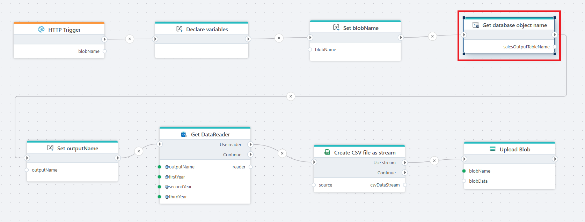

# Get database object name

Gets the database table or view name for an InVision DataStore, Table, or View.

**Example**   
This flow retrieves the name of a database table, converts the result to a [CSV file](../csv/create-csv-file-as-stream.md), and [uploads](../azure-blob-storage/upload-blob.md) that CSV to Azure Blob Storage. The flow is designed for automated data exports and supports large datasets through streaming.

 

## Properties

| Name                 | Data Type | Description                                                                 |
|----------------------|-----------|-----------------------------------------------------------------------------|
| Title                | Optional  | The title or name of the action.                                            |
| Connection           | Required  | The InVision connection used to resolve the database object.                |
| Table object         | Required  | The DataStore, Table, or View for which the database object name is resolved.|
| Result variable name | Required  | The variable that stores the resolved database table or view name.          |
| Disabled             | Optional  | If enabled, the action is skipped during flow execution.                    |
| Description          | Optional  | Additional notes describing the purpose of the action.                      |

## Returns

Returns the name of the database table or view as a [string](https://learn.microsoft.com/en-us/dotnet/api/system.string) value, which can be used by subsequent actions in the flow.