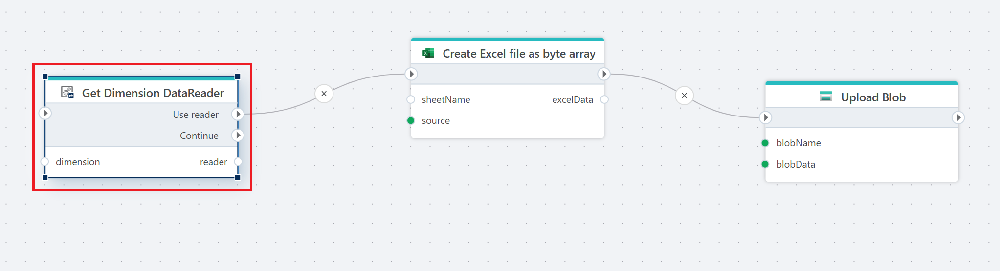

# Get Dimension DataReader

Provides a DataReader for reading a forward-only stream of rows from an InVision Dimension tble.

**Example**   
This flow reads data from an InVision Dimension table using a forward-only data reader and streams the result to downstream actions.  
It retrieves the selected dimension in either wide or parent-child format, exposes the data as a **DataReader**, and passes it to subsequent actions for processing, such as exporting the data to a file or uploading it to storage.

 

## Properties

| Name | Type | Description |
|------|------|-------------|
| Title | Optional | The name of the action as shown in the flow. |
| Connection | Required | A valid [InVision Connection](invision-connection.md) used to read dimension data. |
| Dimension | Required | The dimension to read data from. |
| Table type | Optional | Specifies whether to read from the wide or parent-child dimension table. |
| Reader variable name | Optional | Name of the variable that stores the returned DataReader for use by subsequent actions. |
| Description | Optional | Additional notes about the action or its configuration. |

 

## Returns

[IDataReader](https://learn.microsoft.com/en-us/dotnet/api/system.data.idatareader)

## When to use this action

Use **Get Dimension DataReader** when you need to read large sets of dimension data efficiently and pass them to downstream actions without loading everything into memory at once.

This action is a good fit when you want to:

- Export a dimension to Excel, CSV, or another file format  
- Stream dimension data into external storage or another system  
- Process dimension records sequentially, for example for transformation or validation  
- Work with large dimensions where loading the full result into memory would be inefficient

Because the data is exposed as a forward-only `DataReader`, this action is optimized for streaming and batch-style processing, not for random access or in-flow lookups.

### When not to use it

Avoid this action if you need to:

- Access individual dimension members by key  
- Read the same data multiple times in a flow  
- Modify or update dimension data

In those cases, use actions designed for direct lookup or write operations instead. For example [Load Dimension Tree](load-dimension-tree.md).
