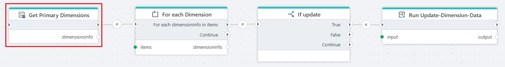

# Get Primary Dimensions

Retrieves a list of Primary Dimension information from all InVision solutions.

**Example**   
This action returns a list of dimension information items. The list is then iterated using a [For each](../built-in/foreach.md) loop, and each item is evaluated with an [If](../built-in/if.md) condition to determine whether it should be updated. When an update is required, the flow triggers an [update flow](../built-in/start-flow.md) action and passes the dimension data as arguments.
 

## Properties

| Name | Type | Description |
|------|------|-------------|
| Title | Optional | The name of the action as shown in the flow. |
| Connection | Required | A valid [InVision Connection](invision-connection.md) used to retrieve dimension metadata. |
| Result variable name | Required | Name of the variable that stores the list of Primary Dimension information for use in subsequent actions. |
| Disabled | Optional | Specifies whether the action is skipped during flow execution. |
| Description | Optional | Additional notes about the action or its configuration. |

 

## Returns

Returns a list of Primary Dimensions available in the connected InVision solution.

Each item in the list contains the following properties:

| Property | Description |
|----------|-------------|
| DimensionId | The unique identifier of the dimension. |
| DimensionName | The name of the dimension. |
| SolutionId | The identifier of the solution containing the dimension. |
| SolutionName | The name of the solution containing the dimension. |
| ParentChildTableName | The name of the dimension’s parent-child table. |
| WideTableName | The name of the dimension’s wide table. |

