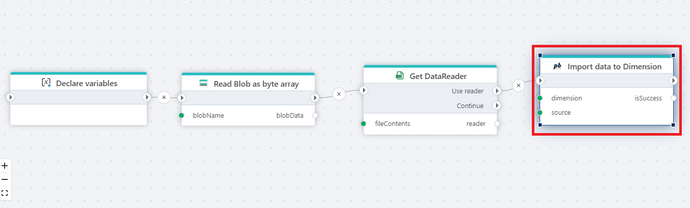

# Import data to Dimension

Imports data into an InVision Dimension from an [IDataReader](https://learn.microsoft.com/en-us/dotnet/api/system.data.idatareader) or [DataTable](https://learn.microsoft.com/en-us/dotnet/api/system.data.datatable). The source of the DataReader or DataTable is typically a database table or file (Excel, Parquet, CSV).

**Example**   
This flow imports external data into an InVision Dimension.
It reads data from a file stored in [Blob Storage](../azure-blob-storage/read-blob-as-byte-array.md), converts the file content into a [DataReader](../csv/open-csv-file-as-datareader.md), and imports the data into the selected dimension. The flow supports updating existing dimension members and optionally controlling how user edits and empty values are handled during the import.
 

## Properties

<!-- prettier-ignore -->
| Name                 | Type     | Description                                            |
| -------------------- | -------- | ------------------------------------------------------ |
| Title                | Optional | The name of the action as shown in the flow.        |
| Connection           | Required | A valid [InVision Connection](invision-connection.md) used to perform the import.       |
| Source               | Required | The data source must be an [IDataReader](https://learn.microsoft.com/en-us/dotnet/api/system.data.idatareader) or a [DataTable](https://learn.microsoft.com/en-us/dotnet/api/system.data.datatable) with columns matching the parent-child table schema. For further details, please read the [Data import format](#data-import-format) section below. |
| Dimension            | Required | The dimension to import data into.       |
| Overwrite user edits | Optional | This option is applicable only when updating an existing dimension member. It determines whether manual changes made by the user to a dimension member's properties since the last import should be retained or overwritten. By default, user edits are preserved. However, setting this option to true will overwrite all manual user edits. Use this option with caution. |
| Import empty values | Optional | This option is applicable only when updating an existing dimension member. It determines whether empty values (e.g., null or empty strings) should be imported and allowed to overwrite existing property values for a dimension member. By default, this is prevented. However, setting this option to true allows overwriting existing property values from previous imports with empty values. Use this option with caution. |
| Created by | Optional | Identifier of the user or system performing the import. |
| Result variable name | Optional | Name of the variable that stores the import result (`true` or `false`). |
| Description | Optional | Additional notes about the action or its configuration. |

## Returns

Returns `true` if the import succeeds, otherwise `false`.  
If **Result variable name** is specified, the value is stored in the given variable.

## Data import format

To import data into a dimension, the columns in the data source (for example SQL Server source table, Excel of Parquet file) must match the table schema of the `parent-child table` of the target dimension.

A parent-child table always has at least 4 columns: `ID`, `ParentID`, `Name` and `SortIndex`. The data type of the first 3 columns is usually `varchar` or `nvarchar`, but other data types may also be used.  
The data type of `SortIndex` is always `int`.

The dimension may also have `properties`, for example `Weight`, `Price` and `Color`. If so, the parent-child table additionally includes one column pr property.

The easiest way to determine the schema of the parent-child table is to open the dimension in the InVision designer and examine the `Key field` Data Type, and optionally the properties. You can also click `Browse P/C Table` in the InVision Designer to view the the parent-child table.

A parent-child dimension table with no properties, nor language support enabled, will look like this:

| ID  | ParentID | Name | SortIndex |
| --- | -------- | ---- | --------- |

A parent-child dimension table with a property named `Color` and support for Norwegian (NO) translations for dimension members will look like this:

| ID  | ParentID | Name | SortIndex | Color | Name_NO |
| --- | -------- | ---- | --------- | ----- | ------- |
